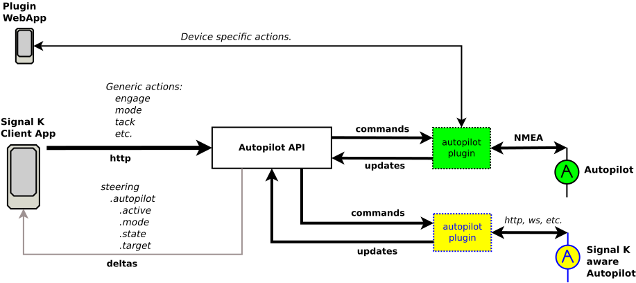

# Autopilot Provider plugins

The Signal K [Autopilot API](../rest-api/autopilot_api.md) provides a way for all Signal K clients to perform common autopilot operations independent of the autopilot device in use. The API is defined in an [OpenAPI](/doc/openapi/?urls.primaryName=autopilot) document.

Requests made to the Autopilot API are received by the Signal K Server, where they are validated and an authorisation check performed, before being passed on to a **provider plugin** to action the request on the autopilot device.

This de-coupling of request handling and autopilot communication provides the flexibility to support a variety of autopilot devices and ensures interoperability and reliabilty.

Autopilot API requests are passed to a **provider plugin** which will process and action the request facilitating communication with the autopilot device.

The following diagram provides an overview of the Autopilot API architectue.



_Autopilot API architecture_

## Provider Plugins

An autopilot provider plugin is a Signal K server plugin that implements the {@link @signalk/server-api!AutopilotProvider | `AutoPilotProvider`} interface, which:

- Tells server the autopilot devices provided for by the plugin
- Registers the methods used to action requests passed from the server to perform autopilot operations.

Multiple providers can be registered and each provider can manage one or more autopilot devices.

**Note: An Autopilot Provider plugin MUST:**

- Implement all Autopilot API interface methods.
- Facilitate communication on the target autopilot device to send commands and retrieve both status and configuration information
- Ensure the `engaged` path attribute value is maintained to reflect the operational status of the autopilot.
- Map the `engage` and `disengage` operations to an appropriate autopilot device `state`.
- Set the state as `off-line` if the autopilot device is not connected or unreachable.
- Set the mode as `dodge` when the autopilot device is is in dodge mode.

## Registering as an Autopilot Provider

A provider plugin must register itself with the Autopilot API during start up by calling the {@link @signalk/server-api!ServerAPI.registerAutopilotProvider | `registerAutopilotProvider`}.

_Example: Plugin registering as an autopilot provider._

```javascript
import { AutopilotProvider } from '@signalk/server-api'

module.exports = function (app) {
  const plugin = {
    id: 'mypluginid',
    name: 'My autopilot Provider plugin'
  }

  const autopilotProvider: AutopilotProvider = {
    getData: (deviceId) => { return ... },
    getState: (deviceId) => { return ... },
    setState: (state, deviceId) => { ... },
    getMode: (deviceId) => { return ... },
    setMode: (mode, deviceId) => { ... },
    getTarget: (deviceId) => { return ... },
    setTarget(value, deviceId) => { ... },
    adjustTarget(value, deviceId) => { ... },
    engage: (deviceId) => { ... },
    disengage: (deviceId) => { ... },
    tack:(direction, deviceId) => { ... },
    gybe:(direction, deviceId) => { ... },
    dodge:(value, deviceId) => { ... }
  }

  const pilots = ['pilot1', 'pilot2']

  plugin.start = function(options) {
    ...
    try {
      app.registerAutopilotProvider(autopilotProvider, pilots)
    }
    catch (error) {
      // handle error
    }
  }

  return plugin
}
```

## Sending Updates and Notifications

The Autopilot API is responsible for sending both update and notification `deltas` to Signal K clients.

Data received from an autopilot device, regardless of the communications protocol (NMEA2000, etc), should be sent to the Autopilot API by calling the {@link @signalk/server-api!ServerAPI.autopilotUpdate | `autopilotUpdate` } method.

This will ensure:

- Default pilot status is correctly maintained
- `steering.autopilot.*` both V1 and V2 deltas are sent

> [!IMPORTANT]
> The values provided via `autopilotUpdate` will be sent in the relevant delta message, so ensure they are in the correct units (e.g. angles in radians, etc).

_Example Update:_

```javascript
app.autopilotUpdate('my-pilot', {
  target: 1.52789,
  mode: 'compass'
})
```

Notifications / Alarms are sent using one of the normalised alarm names below as the path and a `Notification` as the value.

- waypointAdvance
- waypointArrival
- routeComplete
- xte
- heading
- wind

_Example Notification:_

```javascript
app.autopilotUpdate('my-pilot', {
  alarm: {
    path: 'waypointAdvance',
    value: {
      state: 'alert'
      method: ['sound']
      message: 'Waypoint Advance'
    }
  }
})
```

## Unhandled Operations

A provider plugin **MUST** implement **ALL** Autopilot API interface methods, regardless of whether the operation is supported or not.

For an operation that is not supported by the autopilot device, then the plugin should `throw` an exception.

_Example:_

```typescript
{
    // unsupported operation method definition
    async gybe(d, id) {
        throw new Error('Unsupprted operation!)
    }
}
```
