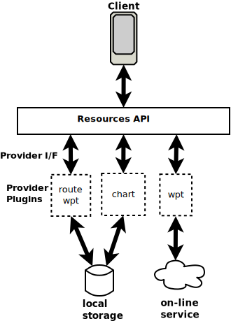

# Resource Provider plugins

The Signal K server _Resource API_ provides a common set operations for clients to interact with routes, waypoints, charts, etc but it does NOT provide the ability to persist or retrieve resources to / from storage.

This functionality needs to be provided by one or more server plugins that interface with the _Resource API_ to facilitate the storage and retrieval of resource data.

These plugins are called __Provider Plugins__.

_Resource API architecture:_



This de-coupling of request handling and data storage provides the flexibility to persist resource data in a variety of different storage types as well as Internet based services.


> [!NOTE]
> Signal K server comes with the [resources-provider-plugin](https://github.com/SignalK/signalk-server/tree/master/packages/resources-provider-plugin) pre-installed which persists resource data to the local file system.

## Resources API

The _[Resources API](../rest-api/resources_api.md)_ handles all client requests received via the `/signalk/v2/api/resources` path, before passing on the request to registered provider plugin(s).

The _Resources API_ performs the following operations when a request is received:
1. Checks for registered provider(s) for the resource type _(i.e. route, waypoint, etc.)_
1. Checks that the required ResourceProvider methods are defined for the requested operation _(i.e. POST, PUT, GET, DELETE)_
1. Performs an access control check
1. `POST` and `PUT` requests for __Standard__ _(Signal K defined)_ resource types are checked for validity of the submitted:
    - `resource id`
    - `resource data` against the OpenAPI definition.

Only after successful completion of all these operations is the request passed on to the registered provider plugin(s).

---

## Provider plugins

A resource provider plugin is a Signal K server plugin that implements the {@link @signalk/server-api!ResourceProvider | ResourceProvider } interface which:
- Tells server the resource type(s) provided for by the plugin _(i.e. route, waypoint, etc.)_
- Registers the methods used to action requests passed from the server and perform the writing, retrieval and deletion of resources from storage. _Note: The plugin __MUST__ implement each method, even if that operation is NOT supported by the plugin!_

> [!NOTE]
> Multiple providers can be registered for a resource type _(e.g. 2 x chart providers)_

_**Note: The Resource Provider is responsible for implementing the methods and returning data in the required format!**_

## Registering as a Resource Provider

To register a plugin as a provider for one or more resource types with the SignalK server, it must call the server's {@link @signalk/server-api!ResourceProviderRegistry.registerResourceProvider | `registerResourceProvider`} function for each resource type being serviced during plugin startup.

_Example: Plugin registering as a routes & waypoints provider._
```javascript
import { ResourceProvider } from '@signalk/server-api'

module.exports = function (app) {

  const plugin = {
    id: 'mypluginid',
    name: 'My Resource Providerplugin'
  }

  const routesProvider: ResourceProvider = {
      type: 'routes',
      methods: {
        listResources: (params) => {
          fetchRoutes(params)
          ...
        },
        getResource: (id, property?) => {
          getRoute(id, property)
          ...
        },
        setResource: (id, value )=> {
          saveRoute(id, value)
          ...
        },
        deleteResource: (id) => {
          deleteRoute(id, value)
          ...
        }
      }
    }

  const waypointsProvider: ResourceProvider = {
      type: 'waypoints',
      methods: {
        listResources: (params) => {
          fetchWaypoints(params)
          ...
        },
        getResource: (id, property?) => {
          getWaypoint(id, property)
          ...
        },
        setResource: (id, value )=> {
          saveWaypoint(id, value)
          ...
        },
        deleteResource: (id) => {
          deleteWaypoint(id, value)
          ...
        }
      }
    }

  plugin.start = function(options) {
    ...
    try {
      app.registerResourceProvider(routesProvider)
      app.registerResourceProvider(waypointsProvider)
    }
    catch (error) {
      // handle error
    }
  }

  return plugin
}
```

## Resource Provider Methods

A Resource Provider plugin must implement ALL methods in {@link @signalk/server-api!ResourceProviderMethods | `ResourceProviderMethods`} to service the requests passed from the server.

Each method should return a __Promise__ on success and `throw` on error, if a request is not serviced or is not implemented.

_Example:_
```javascript
// SignalK server plugin
module.exports = function (app) {

  const plugin = {
    id: 'mypluginid',
    name: 'My Resource Providerplugin',
    start: options => {
      ...
      app.registerResourceProvider({
        type: 'waypoints',
        methods: {
          listResources: (params) => {
            return new Promise( (resolve, reject) => {
              ...
              if (ok) {
                resolve(resource_list)
              } else {
                reject( new Error('Error fetching resources!'))
              }
            })
          },
          getResource: (id, property?) => {
            return new Promise( (resolve, reject) => {
              ...
              if (ok) {
                resolve(resource_list)
              } else {
                reject( new Error('Error fetching resource with supplied id!'))
              }
            })
          },
          setResource: (id, value )=> {
            throw( new Error('Not implemented!'))
          },
          deleteResource: (id) => {
            throw( new Error('Not implemented!'))
          }
        }
      })
    }

  }
}
```
