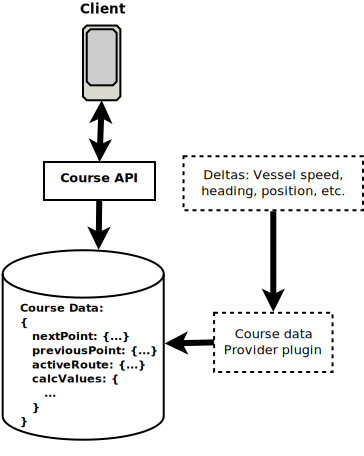

# Course Calculations and Providers

The _Course API_ defines the path `/vessels/self/navigation/course/calcValues` to accommodate the calculated values related to course navigation.

These paths are available to be populated by a "course provider" plugin that uses the course information set using the _Course API_. This approach promotes the extensibility of Signal K server providing flexibility and interoperability. See [Course Provider Plugins](#course-provider-plugins) below.



## Calculated value paths: `calcValues`

The following paths are defined to hold values calculated using the information maintained by _Course API_ operations:

- calcMethod: _("Rhumbline" or "GreatCircle")_
- crossTrackError
- bearingTrackTrue
- bearingTrackMagnetic
- estimatedTimeOfArrival _(e.g. "2022-04-22T05:02:56.484Z")_
- distance
- bearingTrue
- bearingMagnetic
- velocityMadeGood
- timeToGo
- targetSpeed
- previousPoint.distance

_Example:_

```
{
  "calcMethod": "Rhumbline",
  "crossTrackError": 458.784,
  "bearingTrackTrue": 4.58491,
  "bearingTrackMagnetic": 4.51234,
  "estimatedTimeOfArrival": "2022-04-22T05:02:56.484Z",
  "distance": 10157,
  "bearingTrue": 4.58491,
  "bearingMagnetic": 4.51234,
  "velocityMadeGood": 7.2653,
  "timeToGo": 8491,
  "targetSpeed": 2.2653,
  "previousPoint": {
    "distance": 10157
  }
}
```

## Course Notifications

Calculated course values that cross a threshold should trigger a notification so that the necessary action can be taken.

The Course API defines the following notifications which should be implemented by a course provider:

- `navigation.course.arrivalCircleEntered`
- `navigation.course.perpendicularPassed`

## Course Provider Plugins

Signal K server includes the `Course Data Provider` plugin as part of the installation to provide out-of-the-box support for course calculations nd notifications.

This plugin can be replaced with others from the AppStore, or your own, to extend the number and types of calculations performed.

If you are looking to develop a course provider plugin, following are the recommended guidlines:

1. Ensure values are generated for ALL the defined paths (above)
1. Values MUST be calculated using `/vessels/self/navigation/course` path values mainntained by the _Course API_
1. Ensure values are set to null when no destination is set or the value cannot be calculated
1. Perform the calculations using a "worker thread" to minimise impact on the server "main thread"
1. Ensure the worker is set up and shut down as part of plugin "start" and "stop" functions
1. Raise the notifications outlined above.
