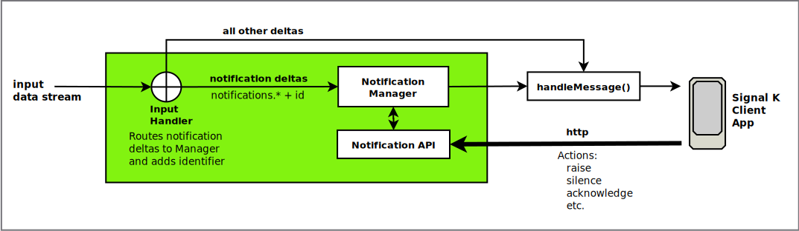

# Notifications API

The Notifications API enables the raising, actioning and centralised management of Signal K notifications and their associated alarms.

## Overview

Notifications are a special type Signal K update delta that convey the occurrence of an event or change in condition.

They contain a `path` value that starts with the text `notifications` and a payload with specific attributes to indicate:

- The severity of the event / condition (`state`)
- How the event / condition should be indicated to the operator (`method`)
- What actions can be / have been taken (`status`)



The **Notifications API** introduces the following components into the Signal K server's
delta processing chain:

1. Notification Manager: Provides centralised management for all notifications including the emission of notification deltas
2. Input Handler: Inspects all incoming deltas and routes notification messages _(i.e. path starts with `notifications`)_ to the Notification Manager.
3. Notification API: REST endpoints for raising and actioning notifications and their associated alarm.

### Terminology

> The Signal K specification uses the terms `notification` and `alarm` interchangably, whilst Signal K Server assigns notification deltas originating from NMEA2000 alarm PGNs with attributes with the term `alert`.

For consistency and clarity this document will use the the following terminology:

- `notification` - A Signal K update delta message with a path starting with the text _notifications._
- `alarm` - The communication of the event / condition to the operator.

### Features

The Notifications API implements a **Notification Manager** that provides the ability to action alarms and lifecycle management.

It does this by:

- Placing notifications into their own `update` in the delta message
- Assigning unique identifier which is used to perform actions
- Adding a `status` property to the payload
- Making available HTTP endpoints at `/signalk/v2/api/notifications` to perform actions
- Providing a plugin interface to allow plugins to access API methods

> **Note:** Actions are only available for notifications containing a payload containing `state` and `method` properties.

## Notification Payload

The Notification API adds the following attributes to the notification payload:

- `id` - Unique identifier that is used when taking action on a notification
- `status` - An object detailing the actions that can be and have been taken

The following attributes can be applied when a notification is raised using the API:

- `createdAt` - Timestamp indicating when the notification was raised
- `position` - Position associated with the notification _(i.e. vessel position when notification was raised)_

_Example_

```json
{
  "state": "emergency",
  "method": ["sound", "visual"],
  "message": "Person Overboard!",
  "id": "a987be59-d26f-46db-afeb-83987b837a8f",
  "status": {
    "silenced": false,
    "acknowledged": false,
    "canSilence": true,
    "canAcknowledge": true,
    "canClear": true
  },
  "createdAt": "2026-04-06T03:34:48.203Z",
  "position": {
    "latitude": 57.73241514375983,
    "longitude": 11.66365146637231
  }
}
```

### Notification Status

The `status` attribute is added to all notifications that have a payload containing `state` and `method` attributes.

The following status properties indicate the actions that **CAN be taken**. Their values are determined by the notification's `state` attribute:

- `canSilence` - indicates whether the Alarm associated with this notification can be silenced
- `canAcknowledge` - indicates whether the Alarm associated with this notification can be acknowledged
- `canClear` - Indicates that the associated Alarm can be cleared (triggering condition has been resolved).

> Note: `canClear` will always be `false` for notifications that are not originated by the Notifcations API.

The remaining properties indicate the actions that **HAVE been taken**:

- `silenced` - `true` when the silence action has been taken
- `acknowledged` - `true` when the acknowledge action has been taken

## Taking Action

The Notification API implements endpoints to raise, update, take action, and clear notifications and their associated alarm at `/signalk/v2/api/notifications/`.

### Raising an Alarm

To raise a new notification with a specified alarm `state` send a HTTP POST request to `/signalk/v2/api/notifications` with an object containing the following properties:

- `state` (mandatory) - alarm state value to set _(e.g. emergency, alarm, etc.)_
- `message` (mandatory) - message to display or speak.
- `path` (optional) - path to assign. _(default: `notifications.{notificationId}`)_
- `idInPath` (optional) - when `true` will append the `notificationId` to the supplied `path` _(e.g. `notifications.myalarm.{notificationId}`)_
- `includePosition` (optional) - when `true` includes the vessel position in the notification payload
- `includeCreatedAt` (optional) - when `true` includes the current date/time in the notification payload
- `data` (optional) - object containing additional key / value pairs to include in the notification payload

The response from a successful `raise` request will contain the `notificationId` of the notification.

```JSON
{
  "state": "COMPLETED",
  "statusCode": 200,
  "id": "a987be59-d26f-46db-afeb-83987b837a8f"
}
```

_Example: Minimal `raise` request_

```typescript
HTTP POST "/signalk/v2/api/notifications"
{
   "state": "alarm"
   "message": "Port engine temperature is very high!"
}
```

_Notification_

```JSON
{
   "path": "notifications.a987be59-d26f-46db-afeb-83987b837a8f",
   "value": {
      "message": "Port engine temperature is very high!",
      "method": ["sound", "visual"],
      "state": "alarm",
      "id": "a987be59-d26f-46db-afeb-83987b837a8f",
      "status": {
         "silenced": false,
         "acknowledged": false,
         "canSilence": true,
         "canAcknowledge": true,
         "canClear": true
      }
   }
}
```

_Example: `raise` request specifying path_

```typescript
HTTP POST "/signalk/v2/api/notifications"
{
   "state": "alarm"
   "message": "Port engine temperature is very high!",
   "path": "propulsion.port.temperature"
}
```

_Notification_

```JSON
{
   "path": "notifications.propulsion.port.temperature",
   "value": {
      "message": "Port engine temperature is very high!",
      "method": ["sound", "visual"],
      "state": "alarm",
      "id": "a987be59-d26f-46db-afeb-83987b837a8f",
      "status": {
         "silenced": false,
         "acknowledged": false,
         "canSilence": true,
         "canAcknowledge": true,
         "canClear": true
      }
   }
}
```

### (MOB) Person Overboard Alarm

To raise a MOB alarm send a HTTP POST request to `/signalk/v2/api/notifications/mob`.

```typescript
HTTP POST "/signalk/v2/api/notifications/mob"
```

_MOB Notification_

```JSON
{
   "path": "notifications.mob.a987be59-d26f-46db-afeb-83987b837a8f",
   "value": {
      "message": "Person Overboard!",
      "method": ["sound", "visual"],
      "state": "emergency",
      "id": "a987be59-d26f-46db-afeb-83987b837a8f",
      "status": {
         "silenced": false,
         "acknowledged": false,
         "canSilence": false,
         "canAcknowledge": true,
         "canClear": true
      },
      "createdAt": "2026-04-06T03:34:48.203Z",
      "position": {
         "latitude": 57.73241514375983,
         "longitude": 11.66365146637231
      }
   }
}
```

To include a specific message, provide a `message` with the request.

```typescript
HTTP POST "/signalk/v2/api/notifications/mob" {
   "message": "Crew member #1 overboard!"
}
```

_MOB Notification_

```JSON
{
   "path": "notifications.mob.a987be59-d26f-46db-afeb-83987b837a8f",
   "value": {
      "message": "Crew member #1 overboard!",
      "method": ["sound", "visual"],
      "state": "emergency",
      "id": "a987be59-d26f-46db-afeb-83987b837a8f",
      "status": {
         "silenced": false,
         "acknowledged": false,
         "canSilence": false,
         "canAcknowledge": true,
         "canClear": true
      },
      "createdAt": "2026-04-06T03:34:48.203Z",
      "position": {
         "latitude": 57.73241514375983,
         "longitude": 11.66365146637231
      }
   }
}
```

### Updating an Alarm

To change the alarm `state` or message send a HTTP PUT request to `/signalk/v2/api/notifications/{notificationId}` with an object containing `state`, `message` and / or `data` properties.

The result of a successful update request that changes the `state` is that:

- `state` is set to the supplied value
- `status.silenced` is set to `false`
- `status.acknowledged` is set to `false`

_Example: Notification payload prior to `update` action request._

```JSON
{
   "message": "Engine temperature is above normal range!",
   "method": ["visual"],
   "state": "warn",
   "id": "a987be59-d26f-46db-afeb-83987b837a8f",
   "status": {
      "silenced": true,
      "acknowledged": false,
      "canSilence": true,
      "canAcknowledge": true,
      "canClear": true
   }
}
```

_Update action request_

```typescript
HTTP PUT "/signalk/v2/api/notifications/a987be59-d26f-46db-afeb-83987b837a8f" {
   "message": "Engine temperature is very high!",
   "state": "alarm"
}
```

_Notification: after successful `update` request_

```JSON
{
   "message": "Engine temperature is very high!",
   "method": ["sound", "visual"],
   "state": "alarm",
   "id": "a987be59-d26f-46db-afeb-83987b837a8f",
   "status": {
      "silenced": false,
      "acknowledged": false,
      "canSilence": true,
      "canAcknowledge": true,
      "canClear": true
   }
}
```

### Clearing an Alarm

> Note: The clear action is only available for alarms associated with notifications having `status.canClear = true`.

To clear the alarm send a HTTP DELETE request to `/signalk/v2/api/notifications/{notificationId}`.

The result of a successful clear request is that the:

- `state` value is set to `normal`
- `status.silenced` is set to `false`
- `status.acknowledged` is set to `false`

If the clear action is requested when the `status.canClear` property is `false`, the alarm will not be cleared and an ERROR response is returned to the requestor.

_Example: Notification payload prior to `clear` action request._

```JSON
{
   "message": "Engine temperature is high!",
   "method": ["visual"],
   "state": "alert",
   "id": "a987be59-d26f-46db-afeb-83987b837a8f",
   "status": {
      "silenced": true,
      "acknowledged": false,
      "canSilence": true,
      "canAcknowledge": true,
      "canClear": true
   }
}
```

_Clear action request_

```typescript
HTTP DELETE "/signalk/v2/api/notifications/a987be59-d26f-46db-afeb-83987b837a8f"
```

_Notification: after successful `clear` request_

```JSON
{
   "message": "Engine temperature is high!",
   "method": ["visual"],
   "state": "normal",
   "id": "a987be59-d26f-46db-afeb-83987b837a8f",
   "status": {
      "silenced": false,
      "acknowledged": false,
      "canSilence": true,
      "canAcknowledge": true,
      "canClear": true
   }
}
```

### Silencing an Alarm

> Note: The silence action is only available for alarms associated with notifications having `status.canSilence = true`.

To silence the alarm send a HTTP POST request to `/signalk/v2/api/notifications/{notificationId}/silence`.

The result of a successful silence request is that the:

- `sound` value is removed from the `method` attribute
- `status.silenced` is set to `true`

If the silence action is requested when the `status.canSilence` property is `false`, the alarm will not be silenced and an ERROR response is returned to the requestor.

> **Note:** Notifications with `state = emergency` cannot be silenced regardless of the value of `status.canSilence`.

_Example: Notification payload prior to `silence` action request._

```JSON
{
   "message": "Engine temperature is high!",
   "method": ["sound", "visual"],
   "state": "alert",
   "id": "a987be59-d26f-46db-afeb-83987b837a8f",
   "status": {
      "silenced": false,
      "acknowledged": false,
      "canSilence": true,
      "canAcknowledge": true,
      "canClear": true
   }
}
```

_Silence action request_

```typescript
HTTP POST "/signalk/v2/api/notifications/a987be59-d26f-46db-afeb-83987b837a8f/silence"
```

_Notification: after successful `silence` request_

```JSON
{
   "message": "Engine temperature is high!",
   "method": ["visual"],
   "state": "alert",
   "id": "a987be59-d26f-46db-afeb-83987b837a8f",
   "status": {
      "silenced": true,
      "acknowledged": false,
      "canSilence": true,
      "canAcknow;edge": true,
      "canClear": true
   }
}
```

### Acknowledging an Alarm

> Note: The acknowledge action is only available for alarms associated with notifications having `status.canAcknowledge` = `true`.

To acknowledge the alarm send a HTTP POST request to `/signalk/v2/api/notifications/{notificationId}/acknowledge`.

The result of a successful acknowledge request is that the:

- Both `sound` & `visual` values are removed from the `method` attribute
- `status.acknowledged` is set to `true`

If the acknowledge action is requested when the `status.canAcknowledge` property is `false`, the alarm will not be acknowledged and an ERROR response is returned to the requestor.

> **Note:** Notifications with `state = emergency` will only have the `sound` value removed from `method`.

_Example: Notification prior to `acknowledge` request._

```JSON
{
   "message": "Engine temperature is high!",
   "method": ["sound", "visual"],
   "state": "alert",
   "id": "a987be59-d26f-46db-afeb-83987b837a8f",
   "status": {
      "silenced": true,
      "acknowledged": false,
      "canSilence": true,
      "canAcknow;edge": true,
      "canClear": true
   }
}
```

_Acknowledge action request_

```typescript
HTTP POST "/signalk/v2/api/notifications/a987be59-d26f-46db-afeb-83987b837a8f/acknowledge"
```

_Notification: after successful `acknowledge` request_

```JSON
{
   "message": "Engine temperature is high!",
   "method": [],
   "state": "alert",
   "id": "a987be59-d26f-46db-afeb-83987b837a8f",
   "status": {
      "silenced": true,
      "acknowledged": true,
      "canSilence": true,
      "canAcknow;edge": true,
      "canClear": true
   }
}
```

## NMEA2000 Alert Handling

NMEA2000 alarm PGNs are processed by `n2k-signalk` which generates Signal K notification deltas as follows:

- Path value starting with `notifications.nmea.*`
- PGN fields mapped to the `state`, `method` and `message` attributes
- Additional attributes capturing PGN field values added to the notification payload.

The **Notification API** uses these additional PGN attributes to populate the notification `status` to align the available actions and any action taken.

_Example: Signal K notification from NMEA2000 Alarm PGN_

```json
{
   "path": "notifications.nmea.alarm.navigational.20.8196" //
   "value": {
      "state": "alarm",
      "method": [
         "visual",
         "sound"
      ],
      "message": "Highwater",
      "alertType": "Alarm",
      "alertCategory": "Navigational",
      "alertSystem": 20,
      "alertId": 8196,
      "dataSourceNetworkIDNAME": 1240095849160158000,
      "dataSourceInstance": 215,
      "dataSourceIndex-Source": 1,
      "occurrence": 2,
      "temporarySilenceStatus": "No",
      "acknowledgeStatus": "No",
      "escalationStatus": "No",
      "temporarySilenceSupport": "No",
      "acknowledgeSupport": "Yes",
      "escalationSupport": "No",
      "acknowledgeSourceNetworkIDNAME": 1233993293343261200,
      "triggerCondition": "Auto",
      "thresholdStatus": "Threshold Exceeded",
      "alertPriority": 0,
      "alertState": "Active"
      }
}
```

### NMEA2000 -> Signal K `state` Mapping

NMEA2000 alarm states are mapped to Signal K notification `state` as follows:

| NMEA2000 State  | Signal K State | Description                                                                                                                        |
| --------------- | -------------- | ---------------------------------------------------------------------------------------------------------------------------------- |
| Emergency Alarm | `emergency`    | A life-threatening condition                                                                                                       |
| Alarm           | `alarm`        | Immediate action is required to prevent loss of life or equipment damage                                                           |
| Warning         | `warn`         | Indicates a condition that requires immediate attention but not immediate action                                                   |
| Caution         | `alert`        | Indicates a safe or normal condition which is brought to the operators attention to impart information for routine action purposes |
| --              | `normal`       | Indicates normal operation.                                                                                                        |
| --              | `nominal`      | This is can be used to indicate value has entered a range within the normal zone                                                   |

_Reference: [Signal K Specification](https://signalk.org/specification/1.7.0/doc/data_model_metadata.html?highlight=emergency#metadata-for-a-data-value)_

### NMEA2000 alarm `method` Mapping

The `n2k-signalk` plugin will set a notification's `method = []` when the NMEA2000 `acknowledgeStatus` OR `temporarySilenceStatus` attributes are set to **"Yes"**.

The **Notifications API** will re-write the `method` attribute value, as outlined above in [Silencing a Notification](#silencing-a-notification) and [Acknowledging a Notification](#acknowledging-a-notification), to ensure alignment across all notifications regardless of source.

## Operations and Notification Properties

> The Notification `method` property is managed by the API and the value assigned is based
> on the value of the `state` and`status` properties.

The tables below detail the resultant notification `method` following the successful completion of an operation.

### 1. Raise

Generates notifications with the following property values:

| Source | State        | Method             | canSilence | canAcknowledge | canClear |
| ------ | ------------ | ------------------ | ---------- | -------------- | -------- |
| API    | `emergency`  | [`visual`,`sound`] | false      | true           | true     |
| Delta  | `emergency`  | [`visual`,`sound`] | false      | true           | false    |
| API    | _all others_ | [`visual`,`sound`] | true       | true           | true     |
| Delta  | _all others_ | [`visual`,`sound`] | true       | true           | false    |

> _Note: All incoming notifications to the Signal K Server, that were not generated
> by the Notification API, will have `canClear = false`._

### 2. Silence

Updates notifcation `method` property:

| Source | Condition           | Method     |
| ------ | ------------------- | ---------- |
| API    | `canSilence = true` | [`visual`] |

### 3. Acknowledge

Updates notifcation `method` property as follows:

| Source | State        | Condition               | Method     |
| ------ | ------------ | ----------------------- | ---------- |
| API    | `emergency`  | `canAcknowledge = true` | [`visual`] |
| API    | _all others_ | `canAcknowledge = true` | []         |

### 4. Clear

Updates notifcation `state` & `status` properties as follows:

| Source | Condition         | State    | silenced | acknowledged |
| ------ | ----------------- | -------- | -------- | ------------ |
| API    | `canClear = true` | `normal` | false    | false        |
