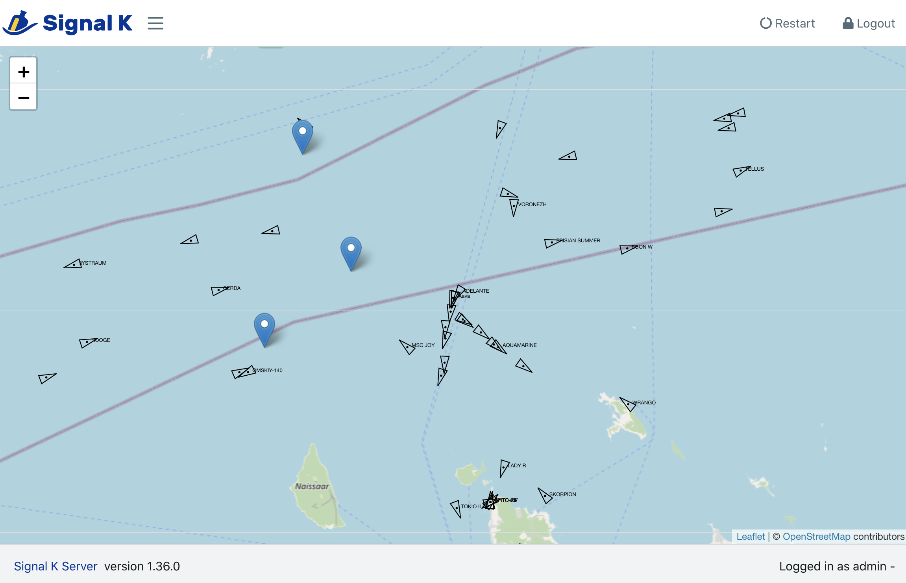
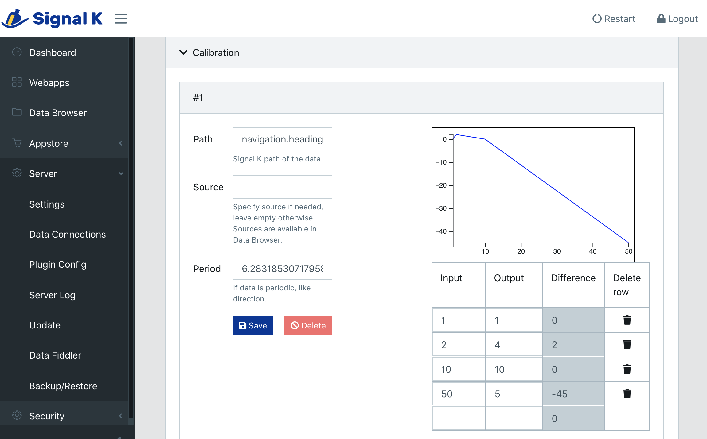

# WebApps and Components

## Introduction

Signal K Server provides the following ways to add web-based user interfaces to enhance functionality and usability:

1. **Standalone WebApps** are web applications that when launched, the server Admin UI disappears and the webapp controls the whole page (browser window / tab).

1. **Embedded WebApps**  are web applications that when launched, are **embedded in the server Admin UI**, leaving the toolbar and menu available to the user.


1. **Embedded Plugin Configuration Forms** are forms provided by a plugin that the server embeds within the _Plugin Config_ screen to replace the generic form rendered using the plugin _configuration schema_. This allows a richer set of controls to be provided for the user to configure the plugin compared to the more generice server generated form provides.


1. **Embedded Components** are individual UI components provided by a plugin or a webapp. They are listed in the _Addons_ section at the bottom of the _Webapps_ page of the Admin UI. More a concept than a fully implemented feature at this stage, the idea is to allow a plugin to add individual components to different parts of the server UI.

All Plugins, WebApps and Components can be installed via the _Appstore_.

## WebApp Structure

All WebApps (like plugins) are installed with `npm`, either from the npm registry or from your own Github repository. Only WebApps that are relevant for all users should be published to `npm` to be made available in the _Appstore_ of all Signal K Servers.

_Note: Private plugins need not be published to `npm` - see the documentation for [npm install](https://docs.npmjs.com/cli/v6/commands/npm-install) for details._


The basic structure of a webapp is:
- A folder named `public` that contains the html, JavaScript and resource files such as images, fonts and style sheets. This folder is automatically mounted by the server so that the webapp is available after installation and the server restarted.
- `package.json` containing special keywords that classifies the webapp:
  - `signalk-webapp` - standalone webapp
  - `signalk-embeddable-webapp` - embeddable webapp
  - `signalk-plugin-configurator` - plugin configuration form

This structure is all that is needed for a standalone webapp.

You can also include the following section in `package.json` to control how your webapp appears in the _Webapps_ list:
```JSON
  "signalk": {
    "appIcon": "./assets/icons/icon-72x72.png",
    "displayName": "Freeboard-SK"
  },
```

where:
- `appIcon` is the path (relative to the `public` directory) to an image within the package to display in the webapp list. The image should be at least 72x72 pixels in size.
- `displayName` is the text you want to appear as the name in the webapp list. _(By default the _name_ attribute in the `package.json` is used.)_. Displayname is also used in an automatic redirect from the root of the server: if you have a webapp with displayName `foo` and you access it using for example the url http://foo.bar.org:3000 the first part of the hostname matches the webapp's displayName and you will be redirected to it instead of the default landingPage, the Admin webapp. With this mechanism you can add easy to access DNS names to each webapp, including .local names.

See also [Working Offline](./README.md#offline-use).

## Application Data: Storing Webapp Data on the Server

Application Data is only supported if security is turned on. It supports two namespaces, one for *global data* and one for *user specific data*. For example, a client might want to store boat specific gauge configuration globally so that other users have access to it. Otherwise, it could use the user area to store user specific preferences.

The data is structured and manipulated in JSON format.

Global storage: `/signalk/v1/applicationData/global/:appid/:version`
User storage: `/signalk/v1/applicationData/user/:appid/:version`

There are two ways to update or add stored data:

* You can POST any json data to any path:

```
POST /signalk/v1/applicationData/user/my-application/1.0/unitPreferences
{
  "shortDistance": "m",
  "longDistance": "km"
}
```

* You can also use json patch format (http://jsonpatch.com):

```
POST /signalk/v1/applicationData/user/my-application/1.0
[
  { "op": "add", "path": "/unitPreferences", "value": { "shortDistace": "m" } },
  { "op": "add", "path": "/unitPreferences/longDistance", "value": "km"}
]
```

Use an HTTP GET request to retrieve data from the server:

`GET /signalk/v1/applicationData/user/my-application/1.0/unitPreferences/shortDistance`

You can just GET the list of keys:
```
GET /signalk/v1/applicationData/user/my-application/1.0/unitPreferences?keys=true
[ "longDistance", "shortDistance"]
```

You get can a list of available versions:
```
GET /signalk/v1/applicationData/user/my-application
[ "1.0", "1.1"]
```

## Discovering Server Features

To assist in tailoring a WebApps UI, it can "discover" the features supported by the server by sending a request to `/signalk/v2/features`.

The response wil contain an object detailing the available APIs and Plugins.

You can use the `enabled` parameter to specify to only return enabled or disabled features.

To list only enabled features:
`/signalk/v2/features?enable=1`

To list only disabled features:
`/signalk/v2/features?enable=0`

_Example response:_
```JSON
{
  "apis": [
    "resources","course"
  ],
  "plugins": [
    {
      "id": "anchoralarm",
      "name": "Anchor Alarm",
      "version": "1.13.0",
      "enabled": true
    },
    {
      "id": "autopilot",
      "name": "Autopilot Control",
      "version": "1.4.0",
      "enabled": false
    },
    {
      "id": "sk-to-nmea2000",
      "name": "Signal K to NMEA 2000",
      "version": "2.17.0",
      "enabled": false
    },
    {
      "id": "udp-nmea-sender",
      "name": "UDP NMEA0183 Sender",
      "version": "2.0.0",
      "enabled": false
    }
  ]
}
```

## Embedded Components and Admin UI / Server interfaces

Embedded components are implemented using [Webpack Federated Modules](https://webpack.js.org/concepts/module-federation/) and [React Code Splitting](https://reactjs.org/docs/code-splitting.html).

_Note: There is no keyword for a module that provides only embedded components, use `signalk-webapp` instead._

You need to configured Webpack to create the necessary code for federation using *ModuleFederationPlugin* and expose the component with fixed names:
- embeddable webapp: `./AppPanel`
- plugin configuration form: `./PluginConfigurationPanel`
- embedded component: `./AddonPanel`

The ModuleFederationPlugin library name must match the package name and be a "safe" name for a webpack module like in `library: { type: 'var', name: packageJson.name.replace(/[-@/]/g, '_') },`

The exposed modules need to `export default` a React component - both class based components and stateless functional components can be used. The server dependencies like `reactstrap` can and should be used. Add `@signalk/server-admin-ui-dependencies` as a dependency to the webapp, it defines the depedencies used by the server admin UI.

See the vesselpositions embedded webapp/component and Calibration plugin for examples of each. It is probably easier to start with either one and modify them to suit your needs. Don't forget to change the module id and name in package.json!


## WebApp / Component and Admin UI / Server interfaces

Standalone WebApps can use the server's APIs _(Signal K http and WebSocket APIs as well as any server specific endpoints)_ but they need to implement everything else themselves.

Embedded WebApps, Components and Plugin Configuration Forms work inside the Admin UI, so they can interact with both the Admin UI and the server using APIs exposed by the Admin UI as component properties.


Embedded webapp properties:
- access to the login status of the browser user
- ability to render Login form instead of the webapp content
- getting and setting application data
- opening an automatically reconnecting WebSocket connection to the server
- getting Signal K data via `get`
- [Embedded](https://github.com/SignalK/signalk-server/blob/master/packages/server-admin-ui/src/views/Webapps/Embedded.js)

PluginConfigurationForm properties:
- `configuration` : the configuration data of the plugin
- `save`: function to save the configuration data
- [EmbeddedPluginConfigurationForm](https://github.com/SignalK/signalk-server/blob/master/packages/server-admin-ui/src/views/Configuration/EmbeddedPluginConfigurationForm.js)


**_Note: The documentation regarding embedded WebApps and Components provided at this time is rudimentary and should be considered under development as the concept is evolving._**

## Authentication and Session Management

Per [the specification](https://signalk.org/specification/1.7.0/doc/security.html#authentication-via-http) the server provides the endpoint `/signalk/v1/auth/login` for logging in. A successful request will
- set an authentication cookie
- return an authentication token

For **cookie based, shared sessions** all a webapp needs to do is use `credentials: "include"` when making api calls with [fetch](https://developer.mozilla.org/en-US/docs/Web/API/Fetch_API/Using_Fetch#sending_a_request_with_credentials_included). Cookies are included automatically in the initial WebSocket opening HTTP request, so the same works automatically for WebSocket connections.

The session cookie's value is the same as the token value: it is a JWT token that includes a validity period and is signed by the server. The server is stateless: JWT is verified for each request for a valid signature and time. Validity period is governed by server's security `expires` configuration value that can be changed in Admin UI's Security section.

The login endpoint has an optional `rememberMe` request parameter. By default, without `rememberMe` set to true, the cookie is erased on browser restarts per standard browser behavior. When true the response's set cookie header includes MaxAge value based on the server's `expires` value. This makes the cookie persist over browser restarts.

As the cookie is set to be [`HttpOnly`](https://developer.mozilla.org/en-US/docs/Web/HTTP/Cookies#security) webapp JavaScript has no access to it. Including it in server requests and persisting its value is managed by the browser, governed by the `Set-Cookie` headers sent by the server.

Additionally the server sets cookie `skLoginInfo` when the user logs in and removes it when the user logs out. A webapp can poll for changes of this cookie to be notified of the browser's cookie based login status.

For **token based sessions** a webapp may manage the authentication token itself. It must include it explicitly in fetch call headers.
As JavaScript has no access to headers but cookies are included automatically by browsers when opening WebSocket connections the server will use the server-set, HttpOnly cookie. Normally browsers do not allow shadowing the server-set cookie with a new value. The only option for WebSocket connections is using a query parameter to override the cookie with a token.

The order that the server uses for finding the JWT token is
1. query parameter `token`
2. request header `authorization`
3. authorization cookie (name managed by the server)

Token-based session management is currently discouraged, because it may result in **session confusion**: all login calls set the shared session cookie for all webapps that are using cookie based, shared sessions.

Each webapp acting separately, managing its authentication token independently, means that
- each application needs to implement token management separately so that closing and reopening the webapp during a browser session does not require the user to reauthenticate
- when navigating between the different webapps the user needs to authenticate to each one separately

The server's Admin UI is a regular webapp using cookie based sessions, there is no separate authentication mechanism.
