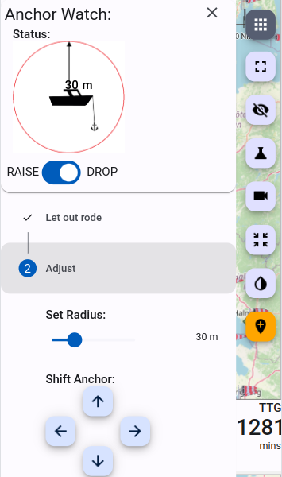
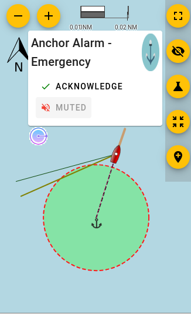

# Feature: Anchor Alarm

This document describes how to setup an anchor alarm using Signal K Server and the WilhelmSK app that:

- Uses the GPS data from your navigation system, not your phone
- Has a graphical map + satellite view
- Vessel movement is saved and displayed as Track on a map
- Provides the ability to move the anchor location
- Sends push notifications to your iPhone (not Android), both remotely via the Internet and locally on the boat
- Sound an audible alarm on a Fusion stereo or via a common speaker connected to a Yacht Devices N2K device
- Does not depend on your phone having enough battery, GPS reception to wake you up

_Image: WilhelmSK App on iPad._

## Prerequisites

- SignalK server installed, for example on a Victron GX device or RaspberryPi. See [Installation](../../installation/README.md) for details.
- [WilhelmSK iOS App](https://itunes.apple.com/us/app/wilhelmsk/id1150499484?mt=8)

For use with other Apps (Android, web apps, etc) see [Alternatives to WilhelmSK](#alternatives-to-wilhelmsk).

## Configuration

**Step 1.** Configure the Vessel data in SignalK server:

Be sure to set:

- Boat length
- GPS Distance from Bow
- GPS Distance from Center.

#### Step 2. Install required Signal K Server plugins:

- Open the Signal K Admin UI and if necessary _Login_
- Select _Appstore -> Available_ from the menu
- Under _Available Apps_ select _All_ from the dropdown

Locate and install each of the following plugins:

- **signalk-anchoralarm-plugin**
- **signalk-push-notifications**
- **signalk-alarm-silencer**
- **@signalk/tracks-plugin**

After installation is complete, restart the server.

_Note: The \_Restart_ button only appears at the upper right of the screen when security has been enabled. (See [Enabling Security](../../security.md#enabling-security) for details.)\_

#### Step 3 Configure the plugins:

Each of the plugins you installed in the previous step need to be configured and enabled. To do this:

- Select `Server -> Plugin Config`` from the menu
- Locate the plugin
- Set the appropriate configuration values
- Click _Submit_.
- Ensure the plugin is _Enabled_.

Following are details of how to configure each plugin:

**_Anchor Alarm plugin:_**

This plugin only needs to be enabled.

No configuration is required as the settings values are populated by WilhelmSK.

**_Alarm Silencer plugin:_**

This plugin only needs to be enabled.

No configuration options available.

**_Push Notifications plugin:_**

- To send notifications via an Internet connection check _Enable Remote Push_.

_Note: The WilhelmSK app uses an Amazon RDS service to deliver push notifications. No additional accounts, etc are required as they are included with purchase._

- _Local Push SSIDs_: Enter the SSID(s) of the WiFi network(s) on your boat which the devices that are to receive notifications are connected.

- _Local Push Port_ specifies the port number that WilhelmSK app will receive the local push notifications.
  The default value is _3001_ and only needs to be changed if that port number is already in use by another app / plugin on the Signal K Server.

_Note: It is not necessary to set the same value in the WilhelmSK app, it auto configures itself._

**_Tracks plugin_**

This plugin keeps track of the position of vessels visible to the Signal K Server. This enables apps to display a track of vessel movements.

The configuration values chosen will determince the amount of resource required run the plugin (and potentially the performance of the Signal K Server) so please consider this when making entries.

The following settings represent conservative values that are suitable for use with an anchor alarm:

- Track resolution: 60000 (60 seconds)
- Points to keep: 240 (4 hours)
- Max idle time: 600 (10 minutes)
- Max Radius: 1 meter (no other vessels).

_Note: This plugin stores the track all the time, not only when on anchor. Which comes in handy when you enable the the anchor alarm a while after having dropped the anchor._

**_Step 4._** Connect WilhelmSK to your SignalK server

After installing the WilhelmSK app, go to the iOS settings screen and check that it has network access permissions.

Also ensure that Background App Refresh also enabled as it is required for local push notifications and to raise an alarm while WilhelmSK app in not open on your phone or tablet.

Once network access has been enabled, start the WilhelmSK app and go to the connections menu.

Your boat's name _(as entered in the vessel data, in step 1 above)_ and suffixed with (Discovered) should appear in the list. _(If you can’t see it please ensure WilhelmSK has been granted network access permissions.)_

Select your boat from the list and the configuration screen is displayed:

- Enter the user name and password that you use when logging into Signal K Server.

- Select _AutoConnect On This Network_. This will cause WilhelmSK to auto-select this connection when on the currently connected WiFi network.

With regards to the other available config options:

- _Request Admin Access_ provides an alternative to using user name and password using a security token instead. Selecting this option sends an [Access Request](../../setup/generating_tokens.md#access-requests) to the SignalK Server. The request will then need to be approved in the _Security -> Access Requests_ screen of the Signal K Admin UI .
- _Port_: 3000 is the standard port.
- _AutoConnect Default_ is used for a remote connection, which is out of scope of this manual.

Finally, verify your connection. Swipe left to back to the main menu and select the same connection:

**_Step 5._** Enable WilhelmSK to receive push notifications

From the _Settings_ menu select _Notifications_.

Note that the actual monitoring of the GPS coordinates is done by Signal K Server itself, not the WilhelmSK app. The app is only used to configure the anchor location, enable the alarm and to receive the alarm notifications.

It is also possible, and highly recommended, to add other notifications. For example via Fusion stereo, if installed, or by using a dry contact with audible alarm. _(These are out of scope of this manual.)_

_Tip: For using the Fusion stereo: search the server plugins with the keyword Fusion._

## Using the Anchor Alarm

Now that the connections have been configured, go to the main screen of the WilhelmSK App where you’ll see something similar to the following screenshot.

If data is being received from the Signal K server, green dots are displayed in the top right of each gauge to indicate that the value displayed is current.

In case of incorrect username and/or password or other connection errors, these will be displayed at the top of the screen as warning.

With an established connection and data being received, swipe to the right a few times to display the anchor watch page.

Clicking the anchor on the top left of screen (next to the menu button), cycles through the sequence of arming / disarming the alarm:

- White anchor indicates disarmed. Click when dropping the anchor and the color will change to yellow.
- Yellow anchor indicates that the rode length is being calculated. Click when you have finished letting out the anchor and the colour will change to green.
- Green anchor means the alarm is armed and ready.

Use the “four arrows icon” on the top left of screen to move the anchor location.

You can also change the alarm radius.

Clicking the green anchor will prompt you to confirm that you want to disarm the alarm / raise the anchor.

_TIP: To return to other pages (i.e. COG and AWA gauges) swipe left by holding the Course up/Head up/North up menu._

---

## Alarms & Notifications

For most use cases, push notifications shouldn’t be the only means of receiving alarms as the phone can decide to hide notifications, etc so additional means of sounding the alarm should be employed.

Following are some alternatives.

### Audible alarms using the Raspberry Pi audio connector

To have the Signal K Server produce audible notifications using a speaker connected directly to the Raspberry Pi audio connector install the [signalk-audio-notifications](https://www.npmjs.com/package/@meri-imperiumi/signalk-audio-notifications) plugin.

### Alarm to NMEA2000 network

To have the Signal K Server forward the alarm to the NMEA2000 network to appear on connected devices, install and configure the [signalk-to-nmea2000](https://www.npmjs.com/package/signalk-to-nmea2000) plugin.

#### Raymarine alarm compatibility

With the Raymarine options enabled in the _signalk-to-nmea2000_ plugin, an audible alarm will be generated on the Raymarine SeaTalkNG Auxiliary Alarm Buzzer - A8061 and will display on Raymarine Axiom plotters.

\_Note: The anchor alarm will be displayed as a “Shallow anchor alarm” on Raymarine, as that is the most suitable alarm type. Interpret that as just an anchor alarm, which has nothing to do with shallow. Here is how it looks on the Raymarine plotter:

#### Garmin alarm compatibility

Compatible

#### Navico (B&G, Simrad, Lowrance) alarm compatibility

Not compatible

#### Yacht Devices compatibility

The [YDAB-01](https://www.yachtd.com/products/alarm_button.html) is a very flexible and configurable device sold by Yacht Devices.

It is connected to the NMEA2000 network and has a 10W audio amplifier which can output sound via a 4 or 8 Ohm speaker which directly connected. It has bank of 28 sound signals can be configured to sound on receipt of the anchor alarm.

#### Additional information

The following post on Panbo is a great resource with regards to the N2K Alert PGNs:
[Link](https://panbo.com/nmea-2000-network-alert-pgns-seem-great-so-why-are-they-hardly-used/)

### Remote notifications

There are a number of Signal K Server plugins which enable notifications to be sent remotely, following are just a few:

#### signalk-pushover-notification-relay

This plugin listens for a change of state in Signal K notifications and sends the updates to the Pushover App which is available for both Apple and Android phones and tablets.

This is a paid service from [Pushover](https://pushover.net/).

_Plugin:_ [signalk-pushover-notification-relay](https://www.npmjs.com/package/signalk-pushover-notification-relay)

#### signalk-notifications-manager

This plugin also works with [Pushover](https://pushover.net/) to deliver notifications as push messages on your phone or tablet, but it also:

- Keeps a history of alerts stored in a local database
- Includes a Signal K web app to manage the notifications.

_Plugin:_ [signalk-notifications-manager](https://www.npmjs.com/package/signalk-notifications)

#### signalk-clicksend-notifications-relay

This plugin forwards notifications via the (paid) Clicksend SMS gateway, which can deliver notifications to your phone.

_Plugin:_ [signalk-clicksend-notifications-relay](https://www.npmjs.com/package/signalk-clicksend-notification-relay)

### Switching a relay

Operating a switch or relay provides a range of options for sounding an alarm but will require diving a bit deeper into the various (and extensive) automation options made available by Signal K Server.

A good place to start is the [signalk-switch-automation](https://github.com/sbender9/signalk-switch-automation) plugin.

---

## Alternatives to WilhelmSK

As the data processing to "watch" the anchor and generate the alarm messages is performed by the Signal K Server,
client applications, any client application that supports the _anchor-alarm_ plugin can be used to arm / disarm and configure it.

Listed below are some other apps and supported operations:

| Client App                           | Arm / disarm | Set radius | Move location |  See track | Plays sound |
| ------------------------------------ | ------------ | ---------- | ------------- | ---------- | ----------- |
| **Wilhelm SK** (iOS)              | yes          | yes        | yes           | yes        | yes         |
| **Anchor alarm plugin** (web app) | yes          | yes        | yes           | yes        | no          |
| **Freeboard SK** (web app)        | yes          | yes        | yes           | yes        | yes         |
| **Aqua Map** (iOS & Android)      | ?            |  ?         |  ?            |  ?         | ?           |

### Anchor Alarm Plugin

The anchor alarm plugin provides a web user interface available under _WebApps_ in the Signal K Server Admin UI.

It provides the ability to arm / disarm, set the radius and shift the anchor but does not display the alarm on screen or play a sound.

### Freeboard SK

Freeboard SK provides a "sequence" driven user interface to "step" through the setting of the anchor alarm.

It provides the ability to drop / raise the anchor, set / adjust the alarm radius and shift the anchor position via the _Anchor Watch_ feature in the main menu.

When set, it will:

- Display the alarm radius on the map
- Show the vessel track whilst anchored

When alarm is triggered:

- Display an alarm notification on screen
- Play a sound

It is available under _WebApps_ in the Signal K Server Admin UI.

