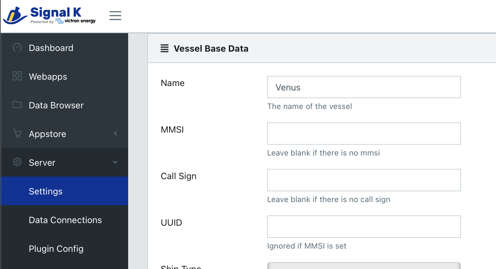
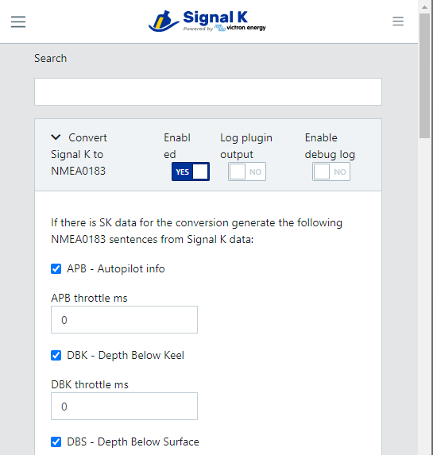
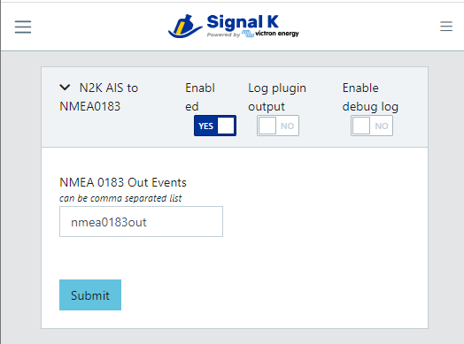
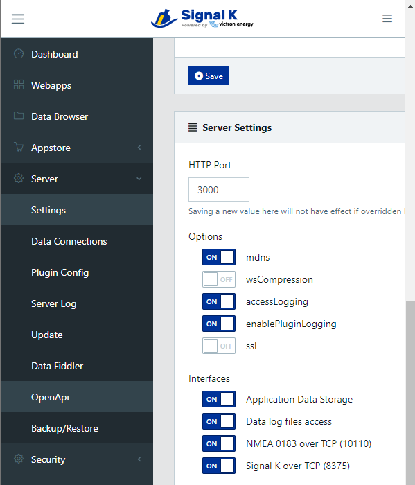
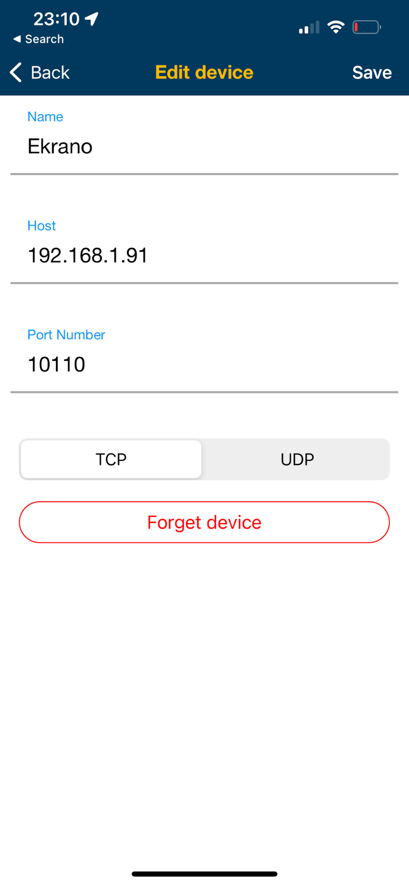

# Signal K Server as a NMEA0183 Data Server

This document details how to setup Signal K Server to read AIS and navigation data from a NMEA2000 (or any other) network and make it available on a WiFi network for use with popular phone / tablet apps like:

- Navionics
- iSailor
- iNavX
- Aqua Map
- WilhelmSK.

The Signal K Server does this by passing the data received from the configured Data Connections, through two plugins which transform it to NMEA0183 sentences, which are then transmitted on the WiFi network.

## Prerequisites

A Signal K Server:

- Installed on a suitable device (e.g. Victron GX, RaspberryPi, etc). _See [Installation](../../installation/README.md) for details._
- Connected to a NMEA2000, etc network and Data Connections configured.
- Connected to a WiFi network. _(Beyond the scope of this document.)_

## Server Setup and Configuration

All configuration is done from within the Signal K Server Admin UI. Open the Admin UI in your browser and complete the following steps.

#### _Step 1._ Enter Vessel Base Data:

- Select _Server -> Setup_ from the menu.

- The **Vessel Base Data** section, enter values for _Length_, _GPS Distance from Bow_ and _GPS Distance from Center_.

#### _Step 2._ Install and Configure Plugins:

The following plugins are required to process and transform the received data to NMEA0183:

- `signalk-to-nmea0183` ([documentation](https://www.npmjs.com/package/@signalk/signalk-to-nmea0183) on npmjs)
- `signalk-n2kais-to-nmea0183` ([documentation](https://www.npmjs.com/package/signalk-n2kais-to-nmea0183) on npmjs)

_Note: Starting with Signal K Server version 2.2.0 these plugins are pre-installed. It is recommended that these plugins be updated to the current version._

**To install the plugins:**

- In the Admin UI, select _Appstore -> Available-> All_ from the menu
- Locate the `signalk-to-nmea0183`plugin and click the install icon
- Locate the `signalk-n2kais-to-nmea0183` plugin and click the install icon
- Restart the Signal K Server.

_Note: If the **Restart** button is not displayed in the upper right of screen, refer to [Enabling Security](../../security.md#enabling-security) for details._

**To configure the plugins:**

- In the Admin UI, select _Server -> Plugin Config_ from the menu.
- Locate `signalk-to-nmea0183` plugin.
  1. Ensure it is enabled
  2. Check ALL the boxes to transmit all NMEA0183 sentence types
  3. Leave the transmission interval (throttle) at 0
  4. Click the **Submit** button to save your choices.

    

- Locate `signalk-n2kais-to-nmea0183` plugin. This plugin transmits all the AIS targets.
  1. Ensure it is enabled
  2. Enter _nmea0183out_ in the **NMEA 0183 Out Events** field.
  3. Click the **Submit** button to save the configuration.

    

#### _Step 3._ Enable NMEA0183 on the WiFi network:

- In the Admin UI, select _Server -> Settings_
- Locate the **Server Settings** section
- Ensure that **NMEA 0183 over TCP (10110)** is set to **On**
- Click **Save** and **Restart** the Signal K Server.

    

Once restarted the Signal K Server will transmit NMEA0183 sentences containing all your navigation and available AIS target data on the WiFi network on TCP port 10110.

_Note: It is recommended that **Signal K over TCP (8375)** is set to **On** if you are using an app (e.g. Aqua Map) which supports the “Signal K over TCP” protocol as it is more feature rich._

## Configuring Apps

Device apps can now be configured to connect to the NMEA0183 data stream from the Signal K Server.

Following is an example of how to connect the Navionics boating app.

- Open the menu
- Select **Paired devices** and add a new paired device
- Enter a name for the device _e.g. MySignalK Server_
- In **Host** enter the IP address of the Signal K Server you configured in the steps above
- In **Port** enter _10110_
- Select **TCP**
- Click **Save**

    
