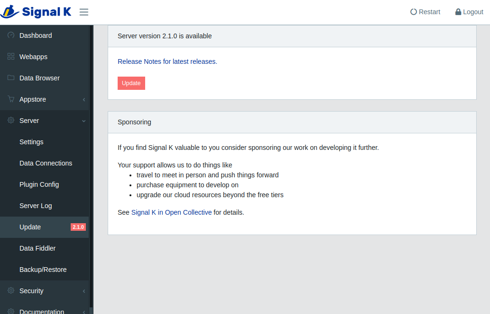

# Updating your Installation

Signal K Server is frequently updated to introduce new features and fix issues that have been reported.
Sometime these updates require that NodeJS or other supporting software on your device to be upgraded to support the new functionality.

Additionally your device's operating system are constantly evolving to address security issues as well as providing new capabilities.

Regularly updating your installation will reduce both the volume of data download and the time taken to complete the process. Connecting your device to a network with good broadband speed before performing an update is recommended.

Updates fall into four categories:

1. Device Operating system (e.g. RaspberryPi OS)
1. NodeJS / NPM
1. Signal K Server
1. Signal K WebApps and Plugins

## Update Device Operating System

Instructions will vary depending on your device but for linux based systems such as the Raspberry Pi the following instructions are used to update the OS.

From a terminal window enter the following commands:

```shell
sudo apt update

sudo apt dist-upgrade
```

If you have not performed an update for a while these commands may take a while to complete, just be patient and make sure everything completes correctly.

After the process has completed `restart` your device.

## Update NodeJS and NPM

To ensure the version of NodeJS on your device is supported by Signal K Server _[(see prerequisites)](README.md#prerequisites)_, check the installed version by
entering the following in a terminal window:

```shell
node -v

# example response
v18.17.0
```

If the version of NodeJS displayed is lower than the version supported by Signal K Server then you can update it with the following command:

```shell
sudo apt upgrade nodejs
```

It is also recommended to update the version of the Node Package Manager (NPM).

```shell
sudo npm install -g npm@latest
```

## Update Signal K Server

When an update is available for Signal K Server a visual indication is displayed in the Admin UI.

**Important!**
Before updating please ensure the version of NodeJS on your device is [supported by Signal K Server](README.md#prerequisites).

_**If you are updating from Signal K Server version v1.40.0 or earlier please [read this first](https://github.com/SignalK/signalk-server/wiki/Installing-and-Updating-Node.js) before proceeding.**_

Click on _Server -> Update_ to display information about the new version.



Click **Update** to start the installation.

After the installation is complete, click **Restart** to launch the updated Signal K Server.

### WebApps and Plugins

After updating Signal K Server some plugins and WebApps may also need to be updated.

The AppStore is where WebApps and Plugins can be installed, removed or updated.
Those with an update available will be listed in _Appstore -> Updates_ in the Admin UI.

Clicking on the _download cloud_ button next to the WebApp / Plugin you wish to update.

After all installations have been completed, click **Restart** to activate the updated WebApps and Plugins.
