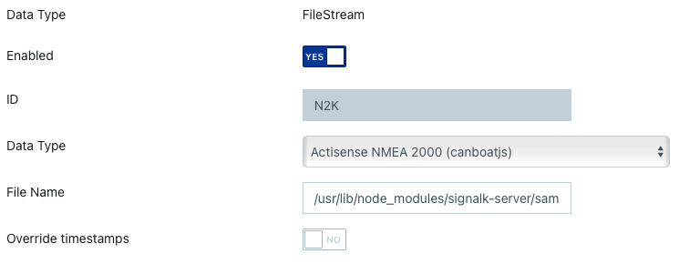

# Configuring Signal K Server

Signal K Server provides an Admin UI to allow you to easily configure your installation.

Open the Admin UI using a web browser on the device where Signal K server is installed (if the defaults have not been changed) by navigating to `http://localhost:3000`.

## Create an Admin account

It is considered good practise to enable security and create an administrator account to controll access to your server and protect your data.

If you ran the `signalk-server-setup` script, security will be enabled and you will be presented with a login screen when accessing the Admin UI.

If the login screen is not displayed, click `Login` _(top right of screen)_ to display the prompt to create a user and password.

Alternatively, from the menu select _Security -> Users_ and then:

1. Click **Add**
1. Enter a **user id**
1. Enter a **password** and confirm it
1. In **Permissions** select **Admin**
1. Click **Apply**.

After creating the account, the server needs to be restarted.

How you restart the server will depend on the installation type _(i.e. installed from NPM, embedded on a commercial device, etc)_. Power cycling the device that Signal K Server is always an option.

## Set up data connections

To get data into Signal K server you will need to configure one or more data connections via the _Server -> Data Connections_ menu option.

From this screen you can add connections for various data types including:

- NMEA2000
- NMEA0183
- Signal K
- SeaTalk
- File Stream

The options presented will vary based on the data type chosen.

**_NMEA2000_**: The processing of NMEA2000 PGNs is done by [n2k-signalk](https://github.com/SignalK/n2k-signalk) via [canboatjs](https://github.com/canboat/canboatjs).

Please refer to the [Canboat PGN database](https://canboat.github.io/canboat/canboat.html) to see what PGNs are supported.

**_NMEA0183_**: The processing of NMEA0183 sentences is done by [nmea0183-signalk](https://github.com/SignalK/signalk-parser-nmea0183)

### NMEA 0183 Options

- _Suppress nmea0183 event_ - All incoming NMEA0183 data is made available over TCP on port 10110 by default. This happens by incoming data being emitted as _nmea0183_ events. Selecting this option will prevent data from this connection appearing on the NEMA0183 TCP service.

- _Input Event_ - By default, data received on this connection will cause the nmea0183 event to be emitted. In order to distinguish input from this connection from other NMEA 0183 connections, enter an input event name which will be emitted (in addition to the nmea0183 event) when data is received on this connection.

- _Validate checksum_ - Usually [NMEA 0183 sentences](https://en.wikipedia.org/wiki/NMEA_0183) contain a checksum that can be used to check that the data is not garbled so that erroneous data is discarded. However some data sources do not include the checksum or it is simply wrong. Unchecking this option will disable validating the checksum.

- _Append Checksum_ - See previous point. Some data sources do not include a checksum, but for example a mobile app you are using may require them. Activating this option will add checksums to the data.

- _Remove NULL characters_ - Some data sources include superfluous NULL characters in the input data stream, making the data invalid for consumption. This option will remove the NULL characters. It causes additional processing, so not on by default.

- _Ignored Sentences_ - NMEA0183 sentences to throw away from the input data. Sometimes you may want to ignore certain sentences from a connection, because the data is invalid or missing or just not needed.

- _Override timestamps_ - NMEA0183 data may include timestamps in tag blocks. These may be off or when playing back captured data you may want to ignore the data and override them with current time when converting to Signal K.

**Connection type "File Stream"**

Sample files are available which can be set up as input for the server.

Use below command to get the path to a NMEA 2000 file with navigation data and AIS targets.

```
sudo find / -name "aava-n2k.data"
```

Set up according to picture.



To get the path for the sample file, data type NMEA 0183, use below command.

```
sudo find / -name "plaka.log"
```

## Install Plugins and Webapps

Signal K server functionality can be extended through the use of plugins and webapps.

Plugins typically extend data acquisition, data processing or enable operations (i.e. protocol conversion, etc).

Webapps provide a user interface to view / interact with data or perform operations enabling full featured solutions such as a Chartplotter.

### Plugin Wizard

For new installations, the **Plugin Wizard** provides an easy way to get started by installing curated bundles of plugins and webapps for common use cases such as chart plotting, anchor monitoring, or data logging.

Access the Plugin Wizard via _Appstore -> Plugin Wizard_ or from the Dashboard prompt on fresh installations.

See the [Plugin Wizard Guide](../guides/plugin_wizard/plugin_wizard.md) for detailed information about available bundles and usage.

### App Store

To install, update or remove individual plugins and webapps select _Appstore_ from the menu.

Select:

- `Installed` to view a list of plugins and webapps currently installed.

- `Updates` to view a list of plugins and webapps that have updates available.

- `Available` to view a list of available plugins and webapps that can be filtered by categry.

The entries displayed with a blue icon are webapps, those with a green icon are plugins and those with both blue and green icons are plugins with a webapp providing a user interface.

_Note: An internet connection is required for Signal K Server to list, install and update AppStore listings._

To install, click the `download` icon on the right hand side of the entry.

To view a list of Plugins and Webapps directly from the NPM registry select the links below.

- [Plugins](https://www.npmjs.com/search?q=keywords%3Asignalk-node-server-plugin)
- [Webapps](https://www.npmjs.com/search?q=keywords:signalk-webapp)

**_Note: A restart of the Signal K server is required after plugins or webapps have been installed or updated._**

Click the _Restart_ button at the top right of the screen to restart the server.

After the server has restarted, the installed plugin(s) can be configued by selecting _Server -> Plugin Config_ menu entry.

## Trouble shooting and the Server Log

If things are not working as expected after installing a plugin or webapp, select _Server -> Server Log_ to view the server's log. If the errors logged there are not providing the information required, you can enable debugging for individual components and plugins by toggling the switch to activate them.

Enabling the `Remember debug setting` ensure your selections are remebered after a server restart.

## Landing page

When you access the Signal K server on a web browser you will be redirected to the Admin webapp as the default `landing page`. You can replace this default with your choice by adding the property `landingPage` in your `settings.json`. For example you can redirect the user to Kip or Freeboard.

## Add your Logo

You can change the logo image displayed at the top left of the Admin UI screen.
To do this, add an SVG file named `logo.svg` in the settings directory _(default: $HOME/.signalk/)_.
