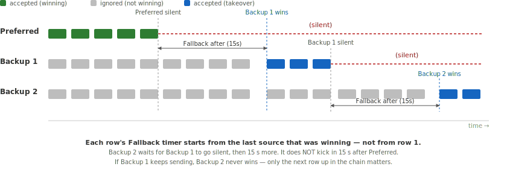

# Source Priority

When multiple data sources publish the same Signal K paths (e.g. two GPS devices both providing `navigation.position`), Signal K Server needs to decide which source to use. The Source Priority system organises sources into **Priority Groups** and lets you set a ranking per group, with optional per-path overrides.

These features are available in the Admin UI under _Data -> Source Priority_.

## Priority Groups

A **Priority Group** is a set of sources that share at least one published path. Groups are derived automatically: whenever two sources publish the same path, they land in the same group. Chains extend transitively — if A and B share a path and B and C share another, A, B and C are all in the same group.

Typical groups you will see on a real boat:

- A **GPS group**: all devices publishing `navigation.position`, `navigation.courseOverGroundTrue`, `navigation.speedOverGround`, etc.
- A **wind group**: masthead transducer, AIS wind reports, derived-data plugin output, etc.
- A **depth group**, **heading group**, and so on.

For each group you set a **source ranking** by dragging the sources into order. The top source is preferred across every shared path in the group, the second source is the first backup, and so on. In most installations, ranking groups is all you need — per-path tweaks are the exception, not the rule.

### Sidebar Badge

The sidebar shows a yellow warning badge on the _Data_ menu item while any group lacks a saved ranking. The number reflects how many groups are still unranked; it drops to zero once every group has an order saved.

## How Rankings Work

Within a group, the top-ranked source is **preferred** — while it is publishing data, its values always win on every shared path. Every other rank has a **Fallback after** value: the number of milliseconds the **currently-winning** source must be silent before that rank is allowed to take over.

The important subtlety: each rank's timer is measured against whichever source is **currently winning**, not against rank 1.

- When the preferred source goes silent, rank 2's Fallback clock starts.
- If and when rank 2 takes over, it becomes the winner. From that moment, rank 3's Fallback clock starts ticking against rank 2, not against rank 1.
- So if rank 2 keeps actively sending after taking over, rank 3 never wins — the chain cascades one step at a time.

The preferred source has no Fallback value because nothing ranks higher. When it returns after any silence, it immediately resumes winning — the backups do not "hold" their position.

### A Worked Example

Three GPS devices on the boat all publish `navigation.position` and related paths. Signal K places them in one group. In the Admin UI the sources appear with human-readable labels; the underlying `$source` values are CAN Names:

| Rank | Shown as                         | `$source` (CAN Name)    | Fallback after |
| ---- | -------------------------------- | ----------------------- | -------------- |
| 1    | Furuno (`can0.c0788c00e7e04312`) | `can0.c0788c00e7e04312` | _preferred_    |
| 2    | Garmin (`can0.c0328400e7e00a86`) | `can0.c0328400e7e00a86` | `15000` (15 s) |
| 3    | serial0.GP                       | `serial0.GP`            | `30000` (30 s) |

Scenarios:

- **Furuno is healthy:** only Furuno values reach subscribers on every shared GPS path. Garmin and serial0.GP are ignored even though they publish continuously.
- **Furuno unplugged, Garmin healthy:** after 15 s of Furuno silence, Garmin takes over and keeps winning as long as it keeps publishing. serial0.GP is still ignored — its 30 s clock is measured against Garmin, but Garmin is never silent.
- **Furuno unplugged AND Garmin unplugged:** after 15 s of Furuno silence, Garmin takes over. 30 s later (measured from Garmin's last value), serial0.GP takes over.
- **Furuno returns:** it immediately wins again, regardless of which backup was winning.

## Path-Level Overrides

A path-level override tells Signal K to use a **different** ranking for one specific path than the group's ranking would imply. Overrides sit inside the group card — they are the exception, not the rule.

A common example: two GPS units land in one group, Furuno is ranked first overall, but the Garmin has a better magnetic-variation (WMM) model. An override on `navigation.magneticVariation` prefers Garmin on that one path while every other shared path still prefers Furuno.

### Disabling a Source on a Path

Inside an override, unchecking **Enabled** on a row blocks that source on this path entirely, no matter how silent the others become. The disabled row stays visible in the list so it can be re-enabled later without re-ordering.

### Ungrouped Overrides

If a path only has a single publisher today, no group is created for it. You can still add an ungrouped override for that path — useful for pre-configuring ranking before a second source arrives, or for disabling a plugin-only path.

## Sources Not Listed

Data from a source that is not listed in the priority table for a path is held back until every listed source has been silent for a safety window. This is so an unconfigured new device on the bus doesn't suddenly hijack a path you have not thought about. The window's default is set conservatively; you can tune it via the Admin UI's _Default Fallback after_ control.

## What is Not Filtered

`notifications.*` paths bypass source priority entirely — every source's notifications are delivered unchanged. Notifications are events, not measurements, so suppressing one source's alarm because another source is "preferred" is never the right behaviour.

All source data is preserved in the server's data model regardless of priority configuration. Priority only affects which source's values are delivered to subscribers by default. See [Source Priority in the Data Browser](#source-priority-in-the-data-browser) for how to view every source's data.

## Source Priority in the Data Browser

The Data Browser (_Data -> Browser_) has a **Sources** dropdown that controls which source's data is displayed:

- **Priority filtered** (default): shows only the preferred source's data for each path, respecting your priority configuration.
- **All sources**: shows data from every source. The preferred source for each path is marked with a green checkmark (**&#10003;**) so you can see which one would win under filtering.

Use **All sources** to:

- Verify that priority configuration is working correctly
- Compare values from different sources
- Debug sensor issues by seeing all incoming data

The **View** dropdown lets you switch between a flat path listing (**Paths**) and a source-grouped view (**By Source**) that shows the same full table grouped under source headers.

## Source Identification

Signal K Server identifies sources differently depending on the connection type:

### NMEA 2000 Sources

N2K sources are identified by their **CAN Name** — a globally unique 64-bit identifier derived from the ISO Address Claim (PGN 60928). Each device on the bus has a unique NAME even if the manufacturer and model are identical (the NAME includes a per-device unique number). This is more reliable than the source address (which can change when devices are added or removed from the bus).

The `$source` field contains the hex-encoded CAN Name (for example `can0.c0788c00e7e04312`) once the device's Address Claim has been received. Until that point the server may use the source address as a placeholder.

The Admin UI shows a human-readable label derived from the manufacturer and model (PGN 60928 + 126996), e.g. _Furuno (can0.c0788c00e7e04312)_. You can set a custom alias via the pencil icon next to any source label. Two identical devices (same manufacturer and model) have different CAN Names, so aliases help distinguish them — e.g. "Bow GPS" and "Stern GPS".

See [NMEA 2000 Device Management](./n2k-device-management.md) for details.

### NMEA 0183 Sources

NMEA 0183 sources are identified by the connection name and talker ID, e.g. `serial0.GP`.

### Plugin Sources

Plugin sources use the plugin ID as their `$source`, e.g. `derived-data` or `signalk-venus-plugin`.
