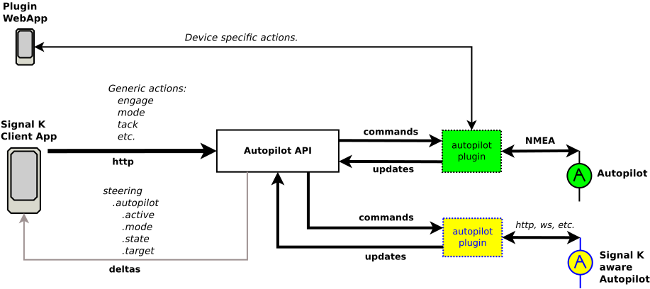

# Autopilot Provider plugins

_This document should be read in conjunction with the [SERVER PLUGINS](./server_plugin.md) document as it contains additional information regarding the development of plugins that implement the Signal K Autopilot API._

---

## Overview

The Signal K Autopilot API defines endpoints under the path `/signalk/v2/api/vessels/self/steering/autopilots` providing a way for all Signal K clients to perform common autopilot operations independent of the autopilot device in use. The API is defined in an [OpenAPI](/doc/openapi/?urls.primaryName=autopilot) document.

Requests made to the Autopilot API are received by the Signal K Server, where they are validated and an authorisation check performed, before being passed on to a **provider plugin** to action the request on the autopilot device.

This de-coupling of request handling and autopilot communication provides the flexibility to support a variety of autopilot devices and ensures interoperability and reliabilty.

Autopilot API requests are passed to a **provider plugin** which will process and action the request facilitating communication with the autopilot device.

The following diagram provides an overview of the Autopilot API architectue.



_Autopilot API architecture_


## Provider Plugins:

An autopilot provider plugin is a Signal K server plugin that implements the **Autopilot Provider Interface** which:
- Tells server the autopilot devices provided for by the plugin
- Registers the methods used to action requests passed from the server to perform autopilot operations.

Note: multiple providers can be registered and each provider can manage one or more autopilot devices.

The `AutopilotProvider` interface is defined as follows in _`@signalk/server-api`_:

```typescript
interface AutopilotProvider {
  getData(deviceId: string): Promise<AutopilotInfo>
  getState(deviceId: string): Promise<string>
  setState(state: string, deviceId: string): Promise<boolean>
  getMode(deviceId: string): Promise<string>
  setMode(mode: string, deviceId: string): Promise<void>
  getTarget(deviceId: string): Promise<number>
  setTarget(value: number, deviceId: string): Promise<void>
  adjustTarget(value: number, deviceId: string): Promise<void>
  engage(deviceId: string): Promise<void>
  disengage(deviceId: string): Promise<void>
  tack(direction: TackGybeDirection, deviceId: string): Promise<void>
  gybe(direction: TackGybeDirection, deviceId: string): Promise<void>
  dodge(direction: TackGybeDirection, deviceId: string): Promise<void>
}
```

**Note: An Autopilot Provider plugin MUST:**
- Implement all Autopilot API interface methods.
- Facilitate communication on the target autopilot device to send commands and retrieve both status and configuration information
- Ensure the `engaged` path attribute value is maintained to reflect the operational status of the autopilot.
- Map the `engage` and `disengage` operations to an appropriate autopilot device `state`.
- Set the state as `off-line` if the autopilot device is not connected or unreachable.


### Registering as an Autopilot Provider

A provider plugin must register itself with the Autopilot API during start up by calling the `registerAutopilotProvider`.

The function has the following signature:

```typescript
app.registerAutopilotProvider(provider: AutopilotProvider, devices: string[])
```
where:

- `provider`: is a valid **AutopilotProvider** object
- `devices`: is an array of identifiers for the autopilot devices managed by the plugin.

_Example: Plugin registering as a routes & waypoints provider._
```javascript
import { AutopilotProvider } from '@signalk/server-api'

module.exports = function (app) {

    const plugin = {
    id: 'mypluginid',
    name: 'My autopilot Provider plugin'
    }

    const autopilotProvider: AutopilotProvider = {
        getData: (deviceId: string) => { return ... },
        getState: (deviceId: string) => { return ... },
        setState: (state: string, deviceId: string) => { return true },
        getMode: (deviceId: string) => { return ... },
        setMode: (mode: string, deviceId: string) => { ... },
        getTarget: (deviceId: string) => { return ... },
        setTarget(value: number, deviceId: string) => { ... },
        adjustTarget(value: number, deviceId: string) => { ... },
        engage: (deviceId: string) => { ... },
        disengage: (deviceId: string) => { ... },
        tack:(direction: TackGybeDirection, deviceId: string) => { ... },
        gybe:(direction: TackGybeDirection, deviceId: string) => { ... }
    }

    const pilots = ['pilot1', 'pilot2']

  plugin.start = function(options) {
    ...
    try {
      app.registerAutopilotProvider(autopilotProvider, pilots)
    }
    catch (error) {
      // handle error
    }
  }

  return plugin
}
```

### Updates from Autopilot device

Updates from an autopilot device are sent to the Autopillot API via the `autopilotUpdate` interface method.

Typically an autopilot provider plugin will call `autopilotUpdate` when receiving data from the autopilot device.

_Note: All updates originating from the autopilot device, regardless of the communications protocol (NMEA2000, etc) should be sent to the Autopilot API using `autopilotUpdate`._

The function has the following signature:

```typescript
app.autopilotUpdate(deviceID: string, attrib: AutopilotUpdateAttrib, value: Value)
```
where:

- `deviceId`: is the autopilot device identifier
- `attrib`: is the attribute / path being updated
- `value`: the new value.

_Example:_
```javascript
app.autopilotUpdate('my-pilot', 'target', 1.52789)
app.autopilotUpdate('my-pilot', 'mode', 'compass')
```

### Alarms from Autopilot device

Alarms from an autopilot device are sent to the Autopillot API via the `autopilotAlarm` interface method.

An autopilot provider plugin will call `autopilotAlarm` when the data received data from the autopilot device is an alarm.

_Note: A set of normalised alarm names are defined and alarm messages from the autopilot device should be mapped to one of the following:_

- `waypointAdvance`
- `waypointArrival`
- `routeComplete`
- `xte`
- `heading`
- `wind`

The function has the following signature:

```typescript
app.autopilotAlarm(deviceID: string, alarmName: AutopilotAlarm, value: Notification)
```
where:

- `deviceId`: is the autopilot device identifier
- `alarmName`: string containing a normalised alarm name.
- `value`: is a Signal K Notification object.

_Example:_
```javascript
app.autopilotAlarm('my-pilot', 'waypointAdvance', {
  state: 'alert'
  method: ['sound']
  message: 'Waypoint Advance'
})
```


### Provider Methods:

**`getData(deviceId)`**: This method returns an AutopilotInfo object containing the current data values and valid options for the supplied autopilot device identifier.

- `deviceId:` identifier of the autopilot device to query.

returns: `Promise<{AutopilotInfo}>`

_Note: It is the responsibility of the autopilot provider plugin to map the value of `engaged` to the current `state`._


_Example:_ 
```
GET signalk/v2/api/vessels/self/steering/autopilots/mypilot1
```
_AutopilotProvider method invocation:_
```javascript
getData('mypilot1');
```

_Returns:_
```javascript
{
  options: {
    states: [
        {
            name: 'auto' // autopilot state name
            engaged: true // actively steering
        },
        {
            name: 'standby' // autopilot state name
            engaged: false // not actively steering
        }
    ]
    modes: ['compass', 'gps', 'wind']
},
  target: 0.326
  mode: 'compass'
  state: 'auto'
  engaged: true
}
```

---
**`getState(deviceId)`**: This method returns the current state of the supplied autopilot device identifier. If the autopilot device is not connected or unreachable then `off-line` should be returned.

- `deviceId:` identifier of the autopilot device to query.

returns: `Promise<{string}>`

_Example:_ 
```
GET signalk/v2/api/vessels/self/steering/autopilots/mypilot1/state
```
_AutopilotProvider method invocation:_
```javascript
getState('mypilot1');
```

_Returns:_
```javascript
'auto'
```

---
**`setState(state, deviceI?)`**: This method sets the autopilot device with the supplied identifier to the supplied state value.

- `state:` state value to set. Must be a valid state value.
- `deviceId:` identifier of the autopilot device to query.

returns: `Promise<{boolean}>` indicating the new value of `engaged`.

throws on error or if supplied state value is invalid.

_Example:_ 
```javascript
PUT signalk/v2/api/vessels/self/steering/autopilots/mypilot1/state {value: "standby"}
```
_AutopilotProvider method invocation:_
```javascript
setState('standby', 'mypilot1');
```

_Returns:_
```javascript
false
```

---
**`getMode(deviceId)`**: This method returns the current mode of the supplied autopilot device identifier.

- `deviceId:` identifier of the autopilot device to query.

returns: `Promise<{string}>`

_Example:_ 
```
GET signalk/v2/api/vessels/self/steering/autopilots/mypilot1/mode
```
_AutopilotProvider method invocation:_
```javascript
getMode('mypilot1');
```

_Returns:_
```javascript
'compass'
```

---
**`setMode(mode, deviceId)`**: This method sets the autopilot device with the supplied identifier to the supplied mode value.

- `mode:` mode value to set. Must be a valid mode value.
- `deviceId:` identifier of the autopilot device to query.

returns: `Promise<{void}>`

throws on error or if supplied mode value is invalid.

_Example:_ 
```javascript
PUT signalk/v2/api/vessels/self/steering/autopilots/mypilot1/mode {value: "gps"}
```
_AutopilotProvider method invocation:_
```javascript
setMode('gps', 'mypilot1');
```

---
**`setTarget(value, deviceId)`**: This method sets target for the autopilot device with the supplied identifier to the supplied value.

- `value:` target value in radians.
- `deviceId:` identifier of the autopilot device to query.

returns: `Promise<{void}>`

throws on error or if supplied target value is outside the valid range.

_Example:_ 
```javascript
PUT signalk/v2/api/vessels/self/steering/autopilots/mypilot1/target {value: 0.361}
```
_AutopilotProvider method invocation:_
```javascript
setTarget(0.361, 'mypilot1');
```

---
**`adjustTarget(value, deviceId)`**: This method adjusts target for the autopilot device with the supplied identifier by the supplied value.

- `value:` value in radians to add to current target value.
- `deviceId:` identifier of the autopilot device to query.

returns: `Promise<{void}>`

throws on error or if supplied target value is outside the valid range.

_Example:_ 
```javascript
PUT signalk/v2/api/vessels/self/steering/autopilots/mypilot1/target {value: 0.361}
```
_AutopilotProvider method invocation:_
```javascript
adjustTarget(0.0276, 'mypilot1');
```

---
**`engage(deviceId)`**: This method sets the state of the autopilot device with the supplied identifier to a state that is actively steering the vessel.

- `deviceId:` identifier of the autopilot device to query.

returns: `Promise<{void}>`

throws on error.

_Example:_ 
```javascript
POST signalk/v2/api/vessels/self/steering/autopilots/mypilot1/engage
```
_AutopilotProvider method invocation:_
```javascript
engage('mypilot1');
```

---
**`disengage(deviceId)`**: This method sets the state of the autopilot device with the supplied identifier to a state that is NOT actively steering the vessel.

- `deviceId:` identifier of the autopilot device to query.

returns: `Promise<{void}>`

throws on error.

_Example:_ 
```javascript
POST signalk/v2/api/vessels/self/steering/autopilots/mypilot1/disengage
```
_AutopilotProvider method invocation:_
```javascript
disengage('mypilot1');
```

---
**`tack(direction, deviceId)`**: This method instructs the autopilot device with the supplied identifier to perform a tack in the supplied direction.

- `direction`: 'port' or 'starboard'
- `deviceId:` identifier of the autopilot device to query.

returns: `Promise<{void}>`

throws on error.

_Example:_ 
```javascript
POST signalk/v2/api/vessels/self/steering/autopilots/mypilot1/tack/port
```
_AutopilotProvider method invocation:_
```javascript
tack('port', 'mypilot1');
```

---
**`gybe(direction, deviceId)`**: This method instructs the autopilot device with the supplied identifier to perform a gybe in the supplied direction.

- `direction`: 'port' or 'starboard'
- `deviceId:` identifier of the autopilot device to query.

returns: `Promise<{void}>`

throws on error.

_Example:_ 
```javascript
POST signalk/v2/api/vessels/self/steering/autopilots/mypilot1/gybe/starboard
```
_AutopilotProvider method invocation:_
```javascript
gybe('starboard', 'mypilot1');
```

---
**`dodge(direction, deviceId)`**: This method instructs the autopilot device with the supplied identifier to manually override the rudder position by two (2) degrees in the supplied direction.

- `direction`: 'port' or 'starboard'
- `deviceId:` identifier of the autopilot device to query.

returns: `Promise<{void}>`

throws on error.

_Example:_ 
```javascript
POST signalk/v2/api/vessels/self/steering/autopilots/mypilot1/dodge/starboard
```
_AutopilotProvider method invocation:_
```javascript
dodge('starboard', 'mypilot1');
```


### Unhandled Operations

A provider plugin **MUST** implement **ALL** Autopilot API interface methods, regardless of whether the operation is supported or not.

For an operation that is not supported by the autopilot device, then the plugin should `throw` an exception.

_Example:_
```typescript
{ 
    // unsupported operation method definition
    gybe: async (d, id) => {
        throw new Error('Unsupprted operation!)
    }
}
```
