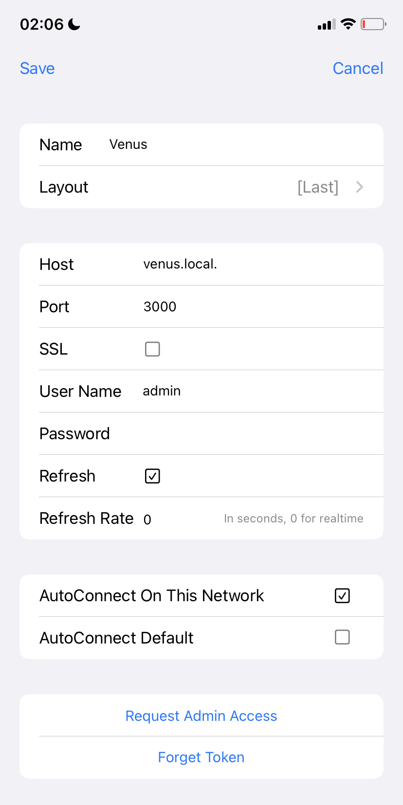
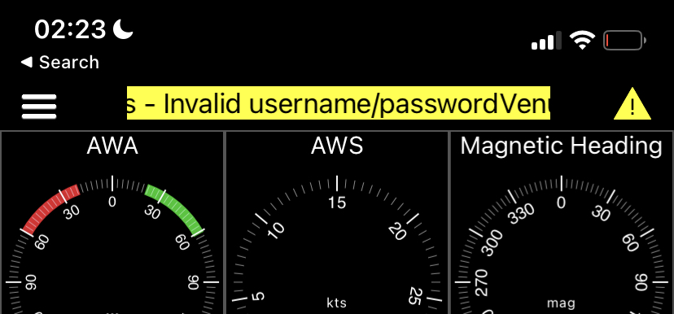

# The Anchor alarm feature

## Introduction

This document explains how to setup the anchor alarm functionality on Signal K Server, as well as operate it using the WilhelmSK app.

This document is part of a Feature Series:
- [WiFi AIS and nav. data server]
- Anchor alarm (this document)

It is a super powerful anchor alarm:

- uses GPS from your nav. system. Not your phone.
- graphical map + satellite view
- option to move the anchor
- push notifications on iPhone (not Android), both remotely via internet, as well as local on the boat.
- audible alarm on Fusion stereo, or via a common speaker connected to Yacht Devices N2K device, as well as other options
- does not depend on phone having enough battery + GPS reception + waking you up
- track is saved and shown on the map

This is the main page in the WilhelmSK App, as used on a tablet:

# Prerequisites

- SignalK server installed, for example on a Victron GX device or RaspberryPi. See [here]() for details.
- [WilhelmSK iOS App](https://itunes.apple.com/us/app/wilhelmsk/id1150499484?mt=8)

For alternatives to the Wilhelm SK app, including Android - as well as generic web apps that run in your browser, see last chapter.

# Configuration instructions

**Step 1.** Configure the Vessel data in SignalK server:

This includes setting boat length, and location of the GPS relative to the boat.

**Step 2.** Install plugins on Signal K server:

Login to Signal K Server, go to Appstore in the menu, and then the “Available” menu. There select “All”, and then search for- and install each of these plugins:

- signalk-anchoralarm-plugin (documentation on npmjs)
- signalk-push-notifications (documentation on npmjs)
- signalk-alarm-silencer (documentation on npmjs)
- track plugin (documentation on npmjs)

After adding all the plugins, first restart the server. There is a restart button on the upper right of the page.If you do not see that restart button, then first set up a user: go to Security -> Users.

Now go to the Server -> Plugin Config menu. Here you need to make sure (for each plugin!) that it is enabled as well as to click the Submit button. Otherwise some of them may seem to be enabled but are not.

Here are the setting of each of the plugins:

*Anchor Alarm plugin:*

Nothing needs to be changed, as most of those are used when enabling the anchor alarm. Do make sure to press Submit to enable it.

*Alarm Silencer plugin:*

Nothing to configure, but, again, make sure to press the Submit button once.

*Push Notifications plugin:*

The first two settings speak for themselves.

The third one, the Local Push Port, defines a port used on the server. The background service of the WilhelmSK app connects to that to receive the local push notifications. It defaults to 3001 and would only need to be changed if it conflicts with something else, such as another plugin that already uses that same port number or something else on the device that hosts Signal K server. Note that it is not needed to set the same in the WilhelmSK app, it auto configures itself for that.

For background: the remote push uses an Amazon RDS service for the push notifications. No special subscription-, account- or service creation at Amazon is required, as that comes included when buying the WilhelmSK app.

Tracks plugin

Make sure to not overdo it with regards to the number of tracks and especially tracks of other ships that need to be kept in memory. Conservative settings are:
- Track resolution: 60000 (60 seconds)
- Points to keep: 240 (4 hours)
- Max idle time: 600 (10 minutes)
- Max Radius: 1 meter (no other vessels).

Note that this plugin stores the track all the time, not only when on anchor. Which comes in handy when you enable the the anchor alarm a while after having dropped the anchor.

*Step 3.* Connect WilhelmSK to your SignalK server
 
After installing the app, open it, and go to the connections menu:

One most systems, that should be as easy as selecting the entry with the name of your boat (as entered in the vessel data, in step 1 above), post fixed with (Discovered). If you can’t see it, check that the WilhelmSK App has network access permissions in the iOS settings:

While there, make sure that Background App Refresh is enabled as well, its needed for local push notifications as well as raising alarm while you are not having the WilhelmSK app open on your phone or tablet.

When going into to configuration of the selected connection you’ll see:

Enter the same user name and password that you use when logging into 

And select “AutoConnect On This Network”. This will make WilhelmSK auto-select this connection when on the same wifi that you are currently on.

With regards to the other available config options:
-nRequest Admin Access is used to request access to SignalK using a security token rather than user name and password. When using that, you’ll have to approve that in the SignalK admin UI.
- Port 3000 is the standard port.
- AutoConnect Default is used for a remote connection, which is out of scope of this manual.

Finally, verify your connection. Swipe left to back to the main menu and select the same connection:

*Step 4.* Enable WilhelmSK push notification receiving

Settings -> Notifications

Note that the actual monitoring of the GPS coordinates is done by SignalK Server itself, ot the WilhelmSK App. The app is only used to configure the anchor location and enable the alarm, as well as to receive the alarm notifications.

Its also possible, and highly recommended, to add other notifications. For example via Fusion stereo if installed, or by using a dry contact with audible alarm. Those are for now out of scope of this manual.

One tip for the Fusion stereo: search the server plugins for the keyword Fusion.

# Audible, remote and other notifications

In the rest of the chapters it is explained how to get notified of the alarm using WilhelmSK push notifications; both locally (not requiring internet) as well as remotely. But for most people that won’t be secure enough: the phone can decide to hide notifications, and so forth.

Here is a list of other options

## Audible alarms

Audio using the audio jack on a raspberry pi
This Signal K Server plugin produces audible notifications using a speaker connected to the Raspberry Pi running Signal K:
https://www.npmjs.com/package/@meri-imperiumi/signalk-audio-notifications

## Alarm to NMEA2000 network
The anchor alarm can also be forwarded to the NMEA2000 network, to use that for notification of the crew. It requires another plugin to be installed and configured, the signalk-to-nmea2000 plugin.

##### Raymarine alarm compatibility:
With the Raymarine options enabled in anove mentioned plugin, an audible alarm will be generated on the Raymarine SeaTalkNG Auxiliary Alarm Buzzer - A8061.

Also it will show on Raymarine Axiom plotters. Note that the anchor alarm shows as a “Shallow anchor alarm” on Raymarine, as that the best fitting alarm that could be found. Interpret that as just an anchor alarm, which has nothing to do with shallow. Here is how it looks on the Raymarine plotter:

##### Garmin alarm compatibility:
Compatible

###### Navico (B&G, Simrad, Lowrance) alarm compatibility:
Not compatible

##### Yacht Devices compatibility:
The YDAB-01 is a very flexible and configurable device sold by Yacht Devices. It is wired onto the NMEA2000 network, and outputs to a simple 4 or 8 Ohm sound speaker (which needs to be purchased separately). It contains a 10W audio amplifier inside and a bank with 28 sound signals, which can be configured to trigger on the anchor alarm. https://www.yachtd.com/products/alarm_button.html

# Further background details
This post on Panbo is a great resource with regards to the N2K Alert PGNs:
https://panbo.com/nmea-2000-network-alert-pgns-seem-great-so-why-are-they-hardly-used/.

And this the thread on Slack where most of the information for this chapter was gathered: https://signalk-dev.slack.com/archives/C02EMP1RF/p1693086271207619

## Remote notifications

Plugin: signalk-pushover-notification-relay
Signalk-node-server plugin that listens for change of state in SignalK notifications and sends the updates via the, paid, push message gateway Pushover (https://pushover.net/). The Pushover App is available for both Apple and Android phones and tablets.
https://www.npmjs.com/package/signalk-pushover-notification-relay

Plugin: signalk-notifications-manager
Similar to the previous listing, this plugin also works with Pushover.net to deliver notifications as push messages on your phone or tablet. But it does a bit more, it keeps a history of alerts, stored in a local database, as well as includes a Signal K web app to manage the notifications.
https://www.npmjs.com/package/signalk-notifications

Plugin: signalk-clicksend-notifications-relay
Forwards notifications to the (paid) Clicksend SMS gateway, which can deliver it to your phone.
https://www.npmjs.com/package/signalk-clicksend-notification-relay

## Switching a relay
Switching a relay requires diving a bit deeper into the various (and extensive!) automation options within Signal K Server. To start, see https://github.com/sbender9/signalk-switch-automation.

# Using the Anchor Alarm

Now, if you’re still in the settings menu, press gauges to go to the normal user section of the WilhelmSK App:

You’ll see something similar to above screenshot. The green dots in the top right of each gauge indicate that data is coming in.

In case of username or password or other connection errors, these will be shown in a yellow warning bar:

Once all works, swipe to the right a few times to get to the anchor watch page:

Clicking the anchor on the top left, right next to the three white bars that opens the menu, goes through the sequence of arming/disarming the alarm:

- White anchor means disarmed. Click when dropping the anchor. It will turn yellow:
- Yellow anchor means its calculating rode length. Click once finished letting out the anchor. It will turn green;
- Green anchor means the alarm is armed and ready. Click again, and the app asks you to confirm to disarm the alarm / raise the anchor.

To set it up in more detail:
Move the anchor location, by pressing the “four arrows icon” on top left.
Change alarm radius

TIP: to return to the earlier pages, with all the gauges such as COG and AWA, swipe left by holding the Course up/Head up/North up menu.

# Alternatives to WilhelmSK

In the solution described above, Signal K Server watches the anchor. WilhelmSK App is used to arm, configure and disarm it.

There are also other apps available for that, here is an overview:

| | Arm/ disarm | Change radius | Move location | See tracks |
| - |------------| --------------| --------------| -----------| 
| Wilhelm SK iOS app| yes| yes| yes| yes |
| Anchor alarm plugin web app| yes| no| no| no
| Freeboard SK web app| yes| no| no| yes
| Aqua map app (iOS & Android) | ? | ? | ?| ? | ?

