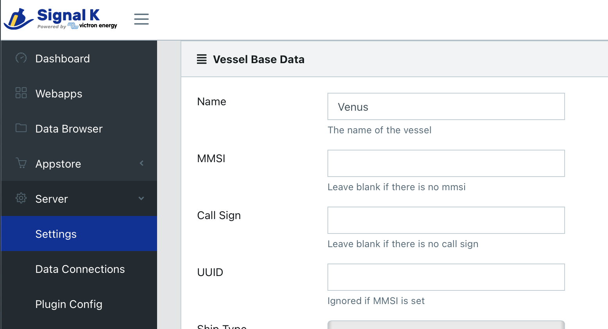
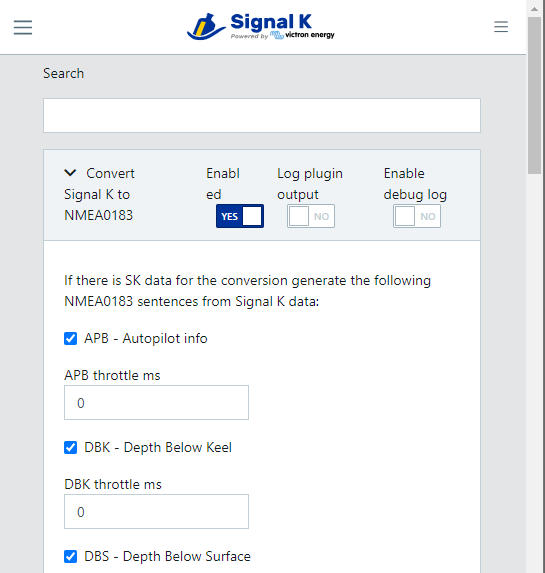
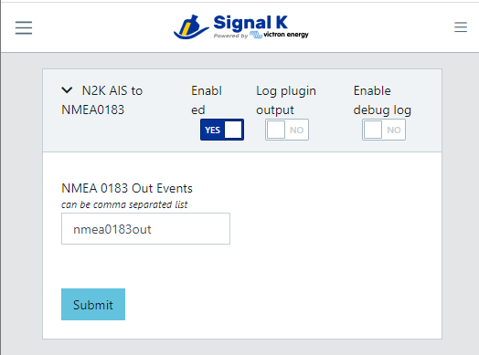
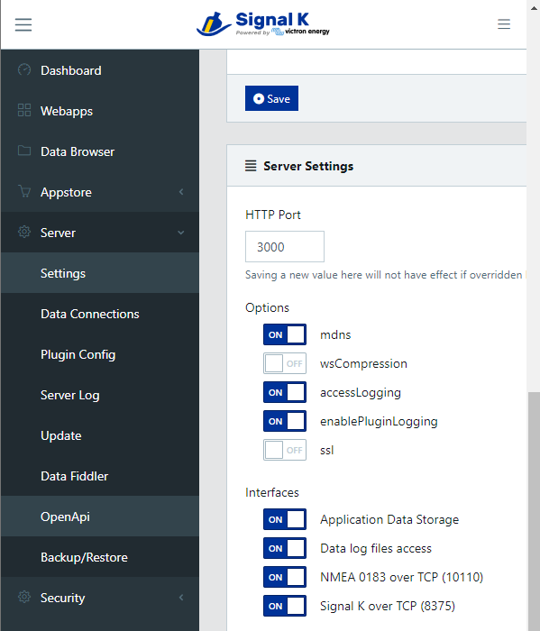
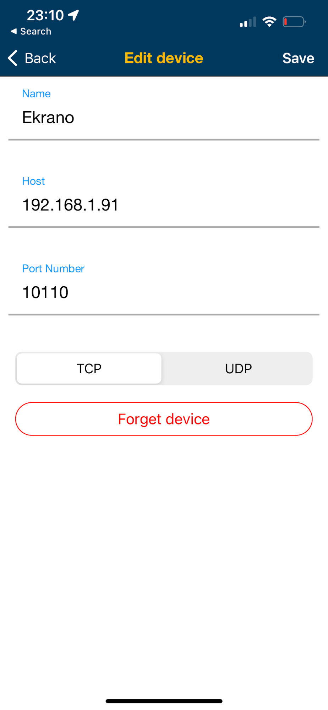

Signal K Server as NMEA 0183 Navigation Data Server

## Introduction

This document explains how to setup Signal K Server to be a wireless AIS and navigation server: make the AIS as well as navigation data from your boats network available on the WiFi for popular apps like Navionics, iSailor, iNavX, Aqua Map and WilhelmSK on your phones and tablets.

When configured for this, the server reads data (AIS, speed, depth, and so forth) from the NMEA2000 network, or any other network that it is connected to, and then makes that data available on the WiFi network.

How it works, a bit simplified, is that through the configured Data Connections, Signal K Server receives all the data. Then, using the two plugins documented here, it will transmit those out on the WiFi network in a format understood by most available navigation apps for phones and tablets.

Note that both plugins convert the Signal K data into the NMEA0183 format. 

## Prerequisites

- Signal K server installed, for example on a Victron GX device or RaspberryPi. See [here](https://github.com/SignalK/signalk-server) for details.
- Data Connections configured and working
- Server on a WiFi network (beyond the scope of this document, depends on your server & network setup)

## Server Setup and Configuration

*Step 1.* Configure the Vessel data in SignalK server:

This includes setting boat length, and location of the GPS relative to the boat.

*Step 2.* Install plugins on Signal K server:

Starting with Signal K version 2.2 the needed plugins are preinstalled.

Login to Signal K Server, go to Appstore in the menu, and then the “Available” menu. There select “All”, and then search for- and install/update each of these plugins:

- signalk-to-nmea0183 ([documentation](https://www.npmjs.com/package/@signalk/signalk-to-nmea0183) on npmjs)
- signalk-n2kais-to-nmea0183 ([documentation](https://www.npmjs.com/package/signalk-n2kais-to-nmea0183) on npmjs)

After adding the plugins, first restart the server. There is a restart button on the upper right of the page. If you do not see that restart button, then first set up a user: go to Security -> Users.

Now go to the Server -> Plugin Config menu. Here you need to make sure (for each plugin!) that it is enabled as well as to click the Submit button. Otherwise some of them may seem to be enabled but are not.

Here are the setting of each of the plugins:

signalk-to-nmea0183 plugin:

This plugin transmits all the navigation data.

Make sure all the boxes are checked. The transmission interval can be left at 0.

When done press Submit to enable the plugin.

signalk-n2kais-to-nmea0183 plugin:

This plugin transmits all the AIS targets.

Configure it as above. Again, make sure to press the Submit button once.

*Step 3.* Enable NMEA0183 for the WiFi/LAN network

In Server -> Settings, make sure that the NMEA 0183 over TCP (10110) setting is enabled:

The number 10110 is the TCP port number, which is default one for this kind of data.

Some apps, such as Aquamaps, support the “Signal K over TCP” protocol, which is a bit more feature rich. Therefore it is recommend to enable that option as well.
 
Now, you’ve successfully made Signal K Server a gateway that makes all your navigation data as well as AIS targets available on the WiFi network.

## Configuring Apps

Navionics boating app

Click menu, then go to Paired devices and add a new paired device. Here is what the settings should look like:

 