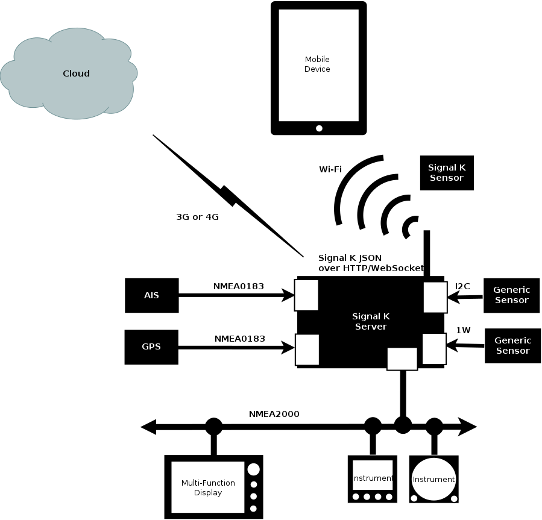

 

## Introduction
Signal K Server is designed to act as a central hub on a vessel where it makes data available to:

1. Apps on your phone and tablet devices
1. Web applications it can host.

Signal K Server implements the _[Signal K Data Standard](https://signalk.org/specification/latest/)_ to facilitate communication and integration among different onboard systems allowing data to be exchanged between NMEA0183, NMEA2000 and other marine protocols.
It can also act as data hub for additional sensors. _(Visit the [Signal K SensESP project](https://github.com/SignalK/SensESP) for [ESP32](https://en.wikipedia.org/wiki/ESP32) for details.)._

Additionally it makes this data available in JSON format to applications and devices over a standard WiFi, LAN or Internet connection via REST APIs and websocket connections.

Its web-based user interface allows for easy configuration and management as well as providing a launchpad for Web Apps.

Signal K Server is also extensible, providing a plugin framework which allows developers to create and publich solutions that integrate and extend its capabilities. These solutions can be published to **npmjs** and installed via the **App Store** in the server's web-based user interface.

