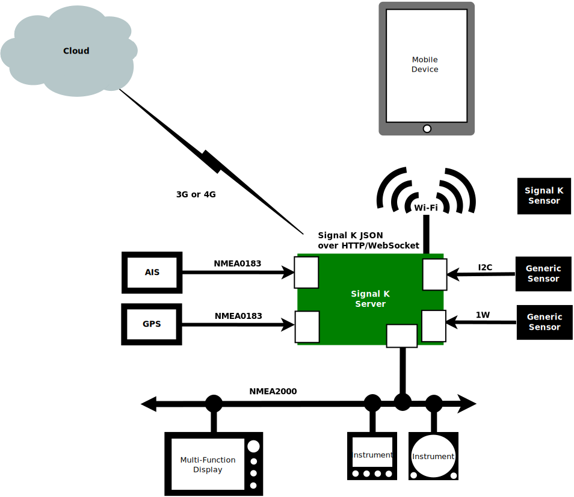

 

## Introduction

Signal K Server is software designed to be deployed on a vessel to act as a central hub which:
1. Collects data from devices and sensors on board 
1. Aggregates and exposes it using the _[Signal K Data Standard](https://signalk.org/specification/latest/)_
1. Exposes the collected data via REST APIs and websocket protocols over a standard WiFi, LAN or Internet connection.

Through implementation of the _[Signal K Data Standard](https://signalk.org/specification/latest/)_, it enables data exchange between NMEA0183, NMEA2000 and other marine protocols facilitating two way communication between the various onboard systems. In addition it can also act as data hub for additional sensors ensuring their data appears within the single data model. _(Visit the [Signal K SensESP project](https://github.com/SignalK/SensESP) for [ESP32](https://en.wikipedia.org/wiki/ESP32) for details.)._

Data is made available to client applications / connections in JSON format making it widely accessible to Apps on phone / tablet devices and web applications.

Signal K Server is also extensible, providing a plugin framework which allows developers to create solutions that integrate and extend its capabilities. These solutions can be published to **npmjs** and installed via the **App Store** in the server's web-based user interface.

