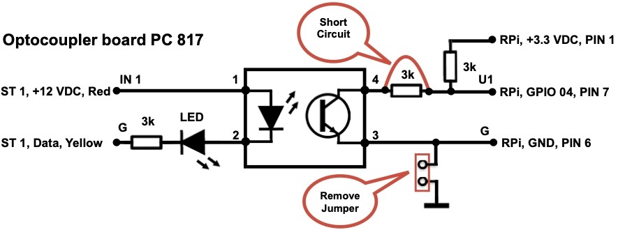
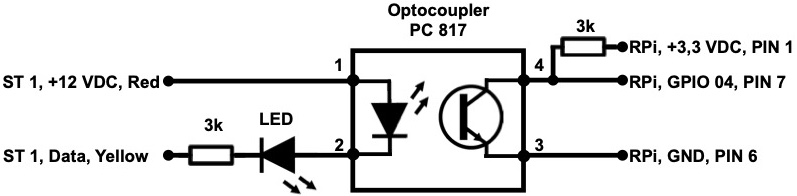
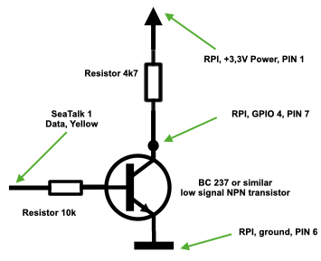
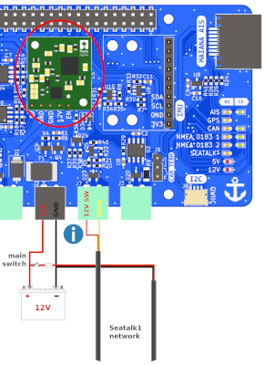
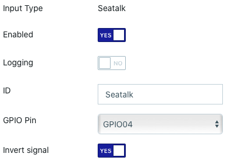
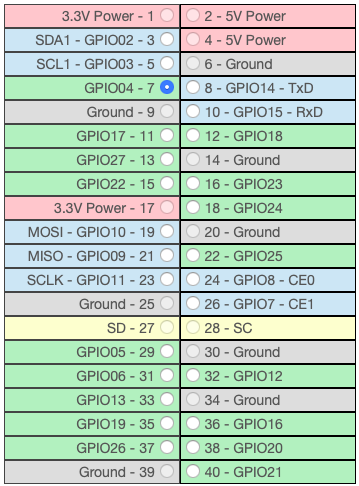

## Seatalk Connections

### Introduction

The Signal K Server supports a variety of data connection types including _Seatalk (GPIO)_ which provides the ability to receive Raymarine Seatalk 1 (ST1) data, via simple DIY hardware connected to a Raspberry Pi GPIO, and convert it to Signal K deltas. This information can then be forwarded by the Signal K Server to a NMEA 0183 or NMEA 2000 network using appropriate hardware and plugins. 

A guide to SeaTalk can be found [here](http://boatprojects.blogspot.com/2012/12/beginners-guide-to-raymarines-seatalk.html).

### Hardware

Using an optocoupler as the hardware interface is recommended as it creates electrical isolation from hazardous voltages and avoids ground loops.

The circuit below uses the [PC817 optocoupler board](https://www.amazon.com/ARCELI-Optocoupler-Isolation-Converter-Photoelectric/dp/B07M78S8LB/ref=sr_1_2?dchild=1&keywords=pc817+optocoupler&qid=1593516071&sr=8-2) but any equivlent product can be used. The LED in the circuit will flicker when there is ST1 traffic. 



If you are building the interface yourself use the below circuit instead. If you don't want any flickering just drop the LED at the input.



A simpler, non-electrically isolated, solution is detailed below, using a low signal NPN transistor which inverts and shifts the voltage from 12V DC to 3.3V DC.



If you do not want to build your own circuit, you can get a **MacArthur HAT** and simply connect it to your Seatalk 1 network [following the manual](https://macarthur-hat-documentation.readthedocs.io/en/latest/seatalk.html). If you also use OpenPlotter with this HAT, all the software will be installed and ready to go.



### Software

Before setting up the data connection on Signal K Server, you may need to install some associated Python libraries on your system. Here you have two options: gpiod library (**Raspberry Pi 3, 4 and 5 models**) or pigpio library (**Raspberry Pi 3 and 4 models**).

#### gpiod (recommended)

Both versions of this library 1.x.x (Debian package) and 2.x.x (Pip package) are supported. It is possible that your system already has one of the two versions of this library installed and some program is already using it, so before installing it we will check if we already have one.

Type this in a terminal:

```
python -m pydoc gpiod | tail
```

If gpiod appears as installed, simply do nothing and go directly to the *Data Connection* section.

If it is not installed, type this in a terminal to install the latest version from pip:

```
sudo pip3 install gpiod
```

Since Debian 12 (Bookworm) and Ubuntu 24 (Noble), pip packages need to be installed in virtual environments, but we need this library to be installed at the system level, so on these systems we need to type this instead:

```
sudo pip3 install gpiod --break-system-packages
```

Pip will complain that the package is being installed in a non-virtual environment, but you can ignore the warning because it has not been detected to break any system packages.

#### pigpio

_Inspired by [Read SeaTalk1 from the Raspberry Pi GPIO using pigpio](https://github.com/Thomas-GeDaD/Seatalk1-Raspi-reader)._

Open a terminal and enter the following:

1. Update the package manifest
```
    sudo apt-get update 
```

2. Install the software
```
    sudo apt-get install pigpio python-pigpio python3-pigpio
```

3. Enable and start the _pigpio_ [daemon](http://abyz.me.uk/rpi/pigpio/) which handles the data connection.
```
    sudo systemctl enable pigpiod && sudo systemctl restart  pigpiod
```

4. Check the _pigpio_service is running 
```
    sudo systemctl status pigpiod
```

_Note: The _pigpio_ deamon by default provides a socket interface on port 8888, which may conflict with other software running on your Raspberry Pi. To have the socket interface use another port you will need to change the [pigpiod.service file](http://abyz.me.uk/rpi/pigpio/pigpiod.html) using the [Python program](http://abyz.me.uk/rpi/pigpio/python.html#pigpio.pi) with the -p option._

### Data Connection

With the required software installed, you can now add a new data connection using the Signal K Server Admin UI.

_Example Data Connection:_



- Select _Server -> Data Connections_ from the main menu.

- Click the **Add** button to create a new connection.

- Select **Seatalk (GPIO)** in the _Data Type_ dropdown list. 

- Set the _Enabled_ to **Yes**.

- Enter an _ID_ _(e.g. Seatalk1)_.

- In *GPIO Library*, select the software that is installed on your system as we have seen in the previous section.

- In _GPIO Pin_, select one of the green GPIO pins from those pictured below _(this will be the pin to which you connect your hardware  e.g. GPIO04)._



- Set _Invert Signal_ based on the hardware interface you have used _(e.g. Select **No** if using the optocoupler hardware setup above. Select **Yes** if using a hardware interface that inverts the ST1 signal)_.

- Click **Apply** to save your data connection settings.

- Restart the Signal K Server.


### Viewing Received Data

Once the server has restarted, confirm that data is being received from the ST1 connection by using the _Data Browser_ in the Admin UI .

The data received via the Seatalk connection will be displayed in the Data Browser with a source value that contains the _ID_ you provided when setting up the connection.

If there is no data displayed in the Data Browser from the Seatalk connection, you can check if there is data available at the selected GPIO using these utilities:

gpiod: https://gist.github.com/astuder/c319cf955f6d651350222d36065981b3

pigpio: https://raw.githubusercontent.com/MatsA/seatalk1-to-NMEA0183/master/STALK_read.py

If the display shows ST1 sentences being received at the GPIO pin then review your data connection settings.
