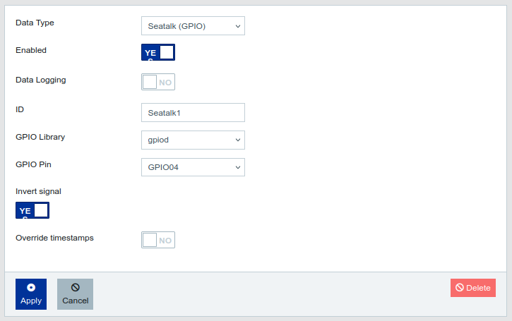

## Seatalk Connections

### Introduction

The Signal K Server supports a variety of data connection types including _Seatalk (GPIO)_ which provides the ability to receive Raymarine Seatalk 1 (ST1) data, via simple DIY hardware connected to a Raspberry Pi GPIO, and convert it to Signal K deltas. This information can then be forwarded by the Signal K Server to a NMEA 0183 or NMEA 2000 network using appropriate hardware and plugins. 

A guide to SeaTalk can be found [here](http://boatprojects.blogspot.com/2012/12/beginners-guide-to-raymarines-seatalk.html).

_Inspired by [Read SeaTalk1 from the Raspberry Pi GPIO using pigpio](https://github.com/Thomas-GeDaD/Seatalk1-Raspi-reader)._

### Hardware


Using an optocoupler as the hardware interface is recommended as it creates electrical isolation from hazardous voltages and avoids ground loops.

The circuit above uses the [PC817 optocoupler](https://www.amazon.com/ARCELI-Optocoupler-Isolation-Converter-Photoelectric/dp/B07M78S8LB/ref=sr_1_2?dchild=1&keywords=pc817+optocoupler&qid=1593516071&sr=8-2) but any equivlent product can be used. The LED in the circuit will flicker when there is ST1 traffic. 

A simpler, non-electrically isolated, solution is detailed below, using a low signal NPN transistor which inverts and shifts the voltage from 12V DC to 3.3V DC.


### Software

Before configuring the data connection in Signal K Server, you will need to install `pigpio` and associated python libraries on the Raspberry PI. 

Open a terminal and enter the following:

1. Update the package manifest
```
    sudo apt-get update 
```

2. Install the software
```
    sudo apt-get install pigpio python-pigpio python3-pigpio
```

3. Enable and start the _pigpio_ [daemon](http://abyz.me.uk/rpi/pigpio/) which handles the data connection.
```
    sudo systemctl enable pigpiod && sudo systemctl restart  pigpiod
```

4. Check the _pigpio_service is running 
```
    sudo systemctl status pigpiod
```

_Note: The _pigpio_ deamon by default provides a socket interface on port 8888, which may conflict with other software running on your Raspberry Pi. To have the socket interface use another port you will need to change the [pigpiod.service file](http://abyz.me.uk/rpi/pigpio/pigpiod.html) using the [Python program](http://abyz.me.uk/rpi/pigpio/python.html#pigpio.pi) with the -p option._

### Data Connection

Now you have installed the required software, you can now add a new data connection using the Signal K Server Admin UI.

_Example Data Connection:_



- Select _Server -> Data Connections_ from the main menu.

- Click the **Add** button to create a new connection.

- Select **Seatalk (GPIO)** in the _Data Type_ dropdown list. 

- Set the _Enabled_ to **Yes**.

- Enter an _ID_ _(e.g. Seatalk)_.

- In _GPIO Pin_, select one of the green GPIO pins from those pictured below _(this will be the pin to which you connect your hardware  e.g. GPIO04)._


- Set _Invert Signal_ based on the hardware interface you have used _(e.g. Select **No** if using the optocoupler hardware setup above. Select **Yes** if using a hardware interface that does invert the ST1 signal)_.

- Click **Apply** to save your data connection settings.

- Restart the Signal K Server.


### Viewing Received Data

Once the server has restarted, confirm that data is being received from the ST1 connection by using the _Data Browser_ in the Admin UI .

The data received via the Seatalk connection will be displayed in the Data Browser with a source value that contains the _ID_ you provided when setting up the connection.

If there is no data displayed in the Data Browser from the Seatalk connection, you can check if there is data available at the selected GPIO using the `STALK_read.py` utility.

You can download a program from a terminal session with the following command:
```
    wget https://raw.githubusercontent.com/MatsA/seatalk1-to-NMEA0183/master/STALK_read.py
```
    
Run the utility with the following command:
```
    sudo python STALK_read.py
```
    
If the display shows ST1 sentences being received at the GPIO pin then review your data connection settings.
