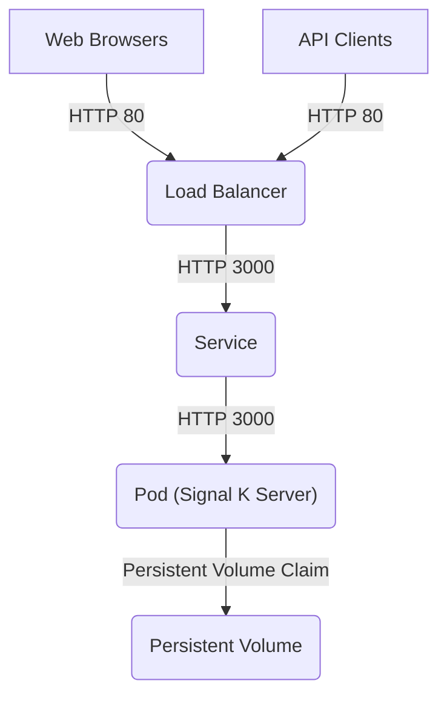

# General

A simple manifest for deploying the Signal K Server is available in the `signalk-deployment.yaml` file.  In addition to the app Deployment, the manifest also includes a Service for connecting to the server and a Persistent Volume Claim for retaining configuration and state data between restarts.

See the [Signal K Server Docker documentation](https://github.com/SignalK/signalk-server/blob/master/docker/README.md) for information on the container images.  The image/tag being deployed is declared in the manifest as `image: signalk/signalk-server:master`


# Quick Start

With the kubectl CLI installed and configured for a running cluster, the manifest can be applied with

```
kubectl apply -f signalk-deployment.yaml
```

> [!NOTE]  
> The cluster must have a [Storage Class](https://kubernetes.io/docs/concepts/storage/storage-classes/) enabled, which many Kubernetes implementations do by default.
>
> If you find the pod stuck in a pending state, it may be due to no available storage class.  See the [Settings and Data Storage](#settings-and-data-storage) section below for more information.


## Reaching the Server

### Load Balancer

Included in the deployment manifest file is a [Service](https://kubernetes.io/docs/concepts/services-networking/service/) resource for attachment to an [external load balancer](https://kubernetes.io/docs/tasks/access-application-cluster/create-external-load-balancer/).  If the cluster has a load balancer with an available IP address, your newly deployed Signal K instance should become externally reachable on an IP address which is included in the output from this command (look for IP and IPs)

```kubectl describe service signalk```

It may take some time for your load balancer to assign addresses.  If the service appears to be stuck in a pending state and you are only interested in quick access to the service, consider using the more simple Ingress method described below.  Troubleshooting a cluster's network configuration is beyond the scope of this document.

#### MicroK8s

An easy to configure load balancer is available in MicroK8s that can be enabled by executing the following command and specifying a range of local IPs to dedicate to it (default ranges will often work)

```microk8s enable metallb```

### Ingress

A simple solution for accessing the server on a local or single-node cluster without setting up a load balancer is to install an [Ingress](https://kubernetes.io/docs/concepts/services-networking/ingress/) resource.  The process for enabling ingress varies between Kubernetes clusters, here are examples for commonly used implementations.

#### minikube

This command will setup a tunnel bound to a random port on the host into the signalk service in the cluster and attempt to launch a new web browser instance at the resulting URL

```minikube service signalk```

Depending on how minikube is deployed, you may need to leave the resulting CLI process running to keep the tunnel available.

#### MicroK8s

An nginx ingress controller can be setup that binds to the host's port 80 by executing the command

```microk8s enable ingress```

You can then deploy the ingress resource in `signalk-ingress.yaml` which routes requests to the controller's root with the command

```kubectl apply -f signalk-ingress.yaml```

The Signal K web UI should now be available at [http://localhost](http://localhost).


# Resource Architecture




# Settings and Data Storage

The deployment manifest includes a resource that uses the Kubernetes [Persistent Volumes](https://kubernetes.io/docs/concepts/storage/persistent-volumes/) subsystem to retain settings and data across multiple deployment replicas and between container restarts.  While many implementations come with a storage class pre-configured with default that allow a quick deployment, considerations should be made to insure that availability and resilience of the stored data meets the requirements of your deployment.

#### MicroK8s

Deployments of MicroK8s does not include a storage class by default which will cause the signalk pod to become stuck in a pending state.  This can be quickly resolved by executing the following command and re-applying the signalk-deployment.yaml file

```microk8s enable storage```


## Uninstall

Execute the following commands to remove all resources you may have added to the cluster while following this document.  This will delete any settings and data that was created while the server was running.

```
kubectl delete deployment signalk
kubectl delete persistentvolumeclaim signalkpvc
kubectl delete service signalk
kubectl delete ingress signalk
```

#### MicroK8s

Execute these commands to disable the ingress and storage addons if needed

```
microk8s disable ingress
microk8s disable storage
```
