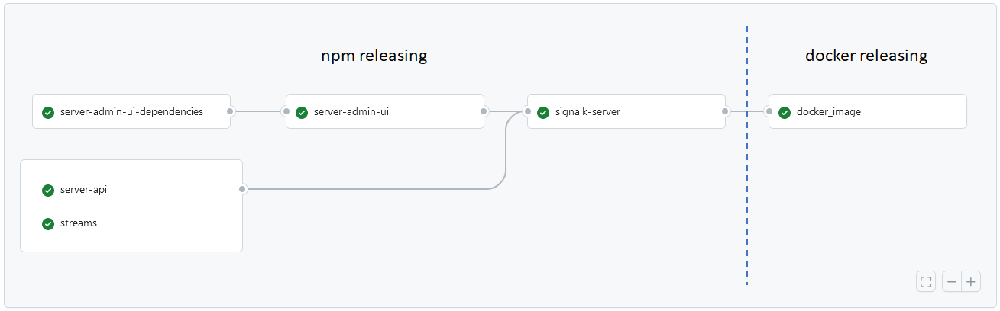

# Releasing a new server version

### (0) Update submodule versions

Update package.jsons of individual modules under `packages` as well as dependent module package.jsons.

Npm Packages are:
- @signalk/server-admin-ui-dependencies
- @signalk/server-admin-ui
- @signalk/server-api
- @signalk/streams
- @signalk/resources-provider
- signalk-server

### (1) Update package.json and git tag using npm version
```
npm version [<newversion> | major | minor | patch | premajor | preminor | prepatch | prerelease | from-git]
```

*Prerelease versions*

- [Check the status in npm](http://registry.npmjs.org/-/package/signalk-server/dist-tags)
- Set package.json version & git tag using `npm version` as usual but specify the version, for example `npm version 1.19.0-beta.2`
- Prerelease version **MUST CONTAIN THE STRING beta** as the release actions branch on that

### (2) Push git tag



This will trigger GH action that 
- builds and publishes all the submodules whose version does not match the latest version in npm
- builds and publishes the server
- builds docker images tagged with version and `latest`
- deploys the version at fly.io as https://demo.signalk.org/
